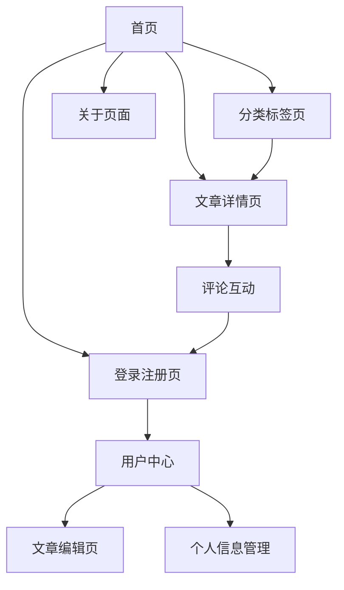

# 博客系统产品需求文档

## 1. Product Overview

一个现代化的个人博客系统，支持用户注册登录、文章发布管理、评论互动等核心功能。
采用前后端分离架构，提供流畅的用户体验和强大的内容管理能力。
目标是为个人用户和小团队提供一个简洁高效的博客发布平台。

## 2. Core Features

### 2.1 User Roles

| Role | Registration Method | Core Permissions |
| ---- | ------------------- | ---------------- |
| 游客   | 无需注册                | 可浏览文章、查看评论       |
| 注册用户 | 邮箱注册                | 可发表评论、点赞文章       |
| 博主   | 管理员邀请               | 可发布文章、管理评论、查看统计  |
| 管理员  | 系统预设                | 全部权限，用户管理、系统配置   |

### 2.2 Feature Module

我们的博客系统包含以下主要页面：

1. **首页**：导航栏、轮播图、文章列表、分页功能
2. **文章详情页**：文章内容、作者信息、评论区、相关推荐
3. **登录注册页**：用户登录、注册表单、密码重置
4. **用户中心**：个人信息、文章管理、评论管理
5. **文章编辑页**：Markdown编辑器、文章发布、草稿保存
6. **分类标签页**：文章分类、标签筛选、搜索功能
7. **关于页面**：博客介绍、联系方式

### 2.3 Page Details

| Page Name | Module Name | Feature description      |
| --------- | ----------- | ------------------------ |
| 首页        | 导航栏         | 显示网站Logo、主菜单、用户登录状态、搜索框  |
| 首页        | 轮播图         | 展示精选文章，自动轮播，点击跳转详情       |
| 首页        | 文章列表        | 显示文章标题、摘要、作者、发布时间、标签、阅读量 |
| 首页        | 分页组件        | 文章列表分页导航，支持页码跳转          |
| 文章详情页     | 文章内容        | 渲染Markdown内容，代码高亮，图片预览   |
| 文章详情页     | 作者信息        | 显示作者头像、昵称、简介、关注按钮        |
| 文章详情页     | 评论系统        | 评论列表、发表评论、回复评论、点赞功能      |
| 文章详情页     | 相关推荐        | 基于标签推荐相关文章               |
| 登录注册页     | 登录表单        | 邮箱密码登录、记住登录状态、第三方登录      |
| 登录注册页     | 注册表单        | 邮箱注册、密码强度验证、邮箱验证         |
| 登录注册页     | 密码重置        | 忘记密码、邮箱验证、密码重置           |
| 用户中心      | 个人信息        | 头像上传、昵称修改、个人简介编辑         |
| 用户中心      | 文章管理        | 文章列表、编辑删除、发布状态管理         |
| 用户中心      | 评论管理        | 我的评论、回复管理、评论审核           |
| 文章编辑页     | Markdown编辑器 | 实时预览、语法高亮、图片上传、自动保存      |
| 文章编辑页     | 文章设置        | 标题、摘要、标签、分类、发布时间设置       |
| 分类标签页     | 分类导航        | 文章分类列表、分类文章统计            |
| 分类标签页     | 标签云         | 热门标签展示、标签筛选功能            |
| 分类标签页     | 搜索功能        | 关键词搜索、高级筛选、搜索历史          |
| 关于页面      | 博客介绍        | 博客简介、建站历程、技术栈介绍          |
| 关于页面      | 联系方式        | 邮箱、社交媒体链接、留言板            |

## 3. Core Process

**游客流程：**
游客可以直接访问首页浏览文章列表，点击文章标题进入详情页阅读完整内容，查看其他用户的评论。如需发表评论或点赞，系统会引导用户进行注册登录。

**注册用户流程：**
用户通过邮箱注册账号，登录后可以在文章详情页发表评论、回复其他评论、点赞文章。在用户中心可以管理个人信息和查看自己的评论历史。

**博主流程：**
博主登录后可以访问文章编辑页面，使用Markdown编辑器创作文章，设置文章标题、摘要、标签和分类，选择立即发布或保存为草稿。在用户中心可以管理所有文章，查看文章统计数据，审核和回复评论。

## 4. User Interface Design

### 4.1 Design Style

* **主色调：** #3B82F6 (蓝色) 和 #1F2937 (深灰色)

* **辅助色：** #F3F4F6 (浅灰背景)、#10B981 (成功绿色)、#EF4444 (错误红色)

* **按钮样式：** 圆角按钮，悬停效果，主要按钮使用渐变色

* **字体：** 中文使用思源黑体，英文使用 Inter，代码使用 Fira Code

* **字体大小：** 标题 24px-32px，正文 16px，小字 14px

* **布局风格：** 卡片式设计，顶部导航栏，响应式布局

* **图标风格：** 使用 Heroicons 线性图标，简洁现代

### 4.2 Page Design Overview

| Page Name | Module Name | UI Elements                    |
| --------- | ----------- | ------------------------------ |
| 首页        | 导航栏         | 白色背景，阴影效果，Logo左对齐，菜单居中，用户信息右对齐 |
| 首页        | 轮播图         | 全宽设计，高度400px，渐变遮罩，白色文字，圆点指示器   |
| 首页        | 文章列表        | 卡片布局，白色背景，圆角8px，悬停阴影效果，标签彩色显示  |
| 文章详情页     | 文章内容        | 最大宽度800px，行高1.7，代码块深色主题，图片居中显示 |
| 文章详情页     | 评论系统        | 嵌套回复设计，头像圆形，时间灰色显示，点赞按钮动画效果    |
| 登录注册页     | 表单设计        | 居中布局，白色卡片，输入框圆角，错误提示红色，按钮全宽    |
| 用户中心      | 侧边导航        | 左侧固定导航，当前页面高亮，图标+文字组合          |
| 文章编辑页     | 编辑器         | 左右分栏，左侧编辑，右侧预览，工具栏固定顶部         |
| 分类标签页     | 标签云         | 不同大小字体，彩色背景，圆角标签，悬停效果          |

### 4.3 Responsiveness

采用移动优先的响应式设计，支持桌面端、平板和手机端。在移动端优化触摸交互，导航栏折叠为汉堡菜单，文章列表改为单列布局，编辑器支持触摸手势操作。

## 5. 功能验收标准

### 5.1 用户认证系统

**功能要求：**

* 用户注册：邮箱格式验证、密码强度检查、重复邮箱提示

* 用户登录：邮箱密码验证、登录状态保持、错误提示

* 密码重置：邮箱验证、安全重置流程

* 权限控制：不同角色权限正确区分

**验收标准：**

* [ ] 注册表单验证所有必填字段

* [ ] 密码至少8位，包含字母和数字

* [ ] 重复邮箱注册显示友好提示

* [ ] 登录成功后正确跳转

* [ ] 登录状态在浏览器刷新后保持

* [ ] 未登录用户访问受保护页面自动跳转登录

* [ ] 不同角色用户看到对应功能菜单

### 5.2 文章管理系统

**功能要求：**

* 文章列表：分页显示、筛选排序、搜索功能

* 文章详情：Markdown渲染、代码高亮、图片显示

* 文章编辑：实时预览、自动保存、图片上传

* 文章发布：草稿保存、状态切换、权限控制

**验收标准：**

* [ ] 文章列表正确分页，每页显示10篇文章

* [ ] 支持按分类、标签、状态筛选文章

* [ ] 搜索功能能准确匹配标题和内容

* [ ] Markdown内容正确渲染，支持常用语法

* [ ] 代码块有语法高亮和复制功能

* [ ] 图片能正常上传和显示

* [ ] 编辑器有实时预览功能

* [ ] 文章能正确保存为草稿或发布

* [ ] 只有作者和管理员能编辑文章

### 5.3 评论系统

**功能要求：**

* 评论显示：嵌套结构、时间排序、分页加载

* 评论发表：内容验证、登录检查、实时更新

* 评论回复：多级回复、@提醒、通知功能

* 评论管理：删除权限、举报功能、审核机制

**验收标准：**

* [ ] 评论按时间倒序显示

* [ ] 支持多级嵌套回复（最多3级）

* [ ] 评论内容不能为空，长度限制500字

* [ ] 未登录用户不能发表评论

* [ ] 评论发表后实时显示在列表中

* [ ] 支持点赞评论，点赞数实时更新

* [ ] 作者和管理员可以删除评论

* [ ] 删除评论时有确认提示

### 5.4 用户中心

**功能要求：**

* 个人信息：头像上传、资料编辑、密码修改

* 文章管理：我的文章、状态管理、统计数据

* 评论管理：我的评论、回复通知、互动记录

**验收标准：**

* [ ] 支持上传头像，格式限制jpg/png，大小限制2MB

* [ ] 个人资料修改后正确保存

* [ ] 密码修改需要验证原密码

* [ ] 我的文章页面显示所有自己的文章

* [ ] 可以快速切换文章发布状态

* [ ] 显示文章阅读量、点赞数等统计

* [ ] 我的评论页面显示所有评论记录

* [ ] 有新回复时显示通知提醒

### 5.5 分类标签系统

**功能要求：**

* 分类管理：分类列表、文章统计、分类筛选

* 标签管理：标签云、热门标签、标签筛选

* 搜索功能：关键词搜索、高级筛选、搜索建议

**验收标准：**

* [ ] 分类页面显示所有分类和文章数量

* [ ] 点击分类能正确筛选文章

* [ ] 标签云按使用频率显示不同大小

* [ ] 点击标签能正确筛选文章

* [ ] 搜索支持标题和内容关键词匹配

* [ ] 搜索结果高亮显示匹配关键词

* [ ] 支持多条件组合筛选

## 6. 第二阶段：文章管理系统详细需求

### 6.1 文章CRUD操作

#### 6.1.1 创建文章

**功能描述：** 用户可以创建新文章，支持Markdown编辑和实时预览

**具体需求：**

* 文章标题：必填，长度限制1-100字符，支持中英文

* 文章内容：支持Markdown语法，实时预览，自动保存草稿

* 文章摘要：可选，长度限制200字符，用于列表页展示

* 封面图片：可选，支持上传jpg/png格式，大小限制5MB

* 发布状态：草稿/已发布/私密，默认为草稿

* 发布时间：可设置定时发布，默认为当前时间

**用户界面：**

* 左右分栏布局：左侧Markdown编辑器，右侧实时预览

* 顶部工具栏：保存、预览、发布按钮，字数统计

* 右侧设置面板：文章属性设置（标题、摘要、分类、标签等）

* 底部状态栏：自动保存状态、最后保存时间

#### 6.1.2 读取文章

**功能描述：** 用户可以查看文章列表和文章详情

**文章列表页：**

* 显示文章标题、摘要、作者、发布时间、分类、标签

* 支持分页，每页显示10篇文章

* 支持按发布时间、阅读量、点赞数排序

* 支持按分类、标签、作者筛选

* 搜索功能：支持标题和内容关键词搜索

**文章详情页：**

* 完整显示文章内容，Markdown渲染

* 文章元信息：作者、发布时间、阅读量、点赞数

* 文章标签和分类链接

* 上一篇/下一篇文章导航

* 相关文章推荐（基于标签匹配）

#### 6.1.3 更新文章

**功能描述：** 作者和管理员可以编辑已发布的文章

**权限控制：**

* 只有文章作者和管理员可以编辑

* 编辑时显示"正在编辑"状态，防止并发编辑冲突

* 保存编辑历史，支持版本回退

**编辑功能：**

* 复用创建文章的编辑器界面

* 预填充现有文章内容

* 支持修改所有文章属性

* 编辑后可选择更新发布时间或保持原时间

#### 6.1.4 删除文章

**功能描述：** 作者和管理员可以删除文章

**删除流程：**

* 软删除：文章标记为已删除，不在前台显示

* 删除确认：二次确认对话框，防止误删

* 批量删除：支持选择多篇文章批量删除

* 回收站：已删除文章进入回收站，30天后永久删除

### 6.2 分类管理系统

#### 6.2.1 分类CRUD操作

**创建分类：**

* 分类名称：必填，长度限制1-20字符，同一用户下不能重复

* 分类描述：可选，长度限制100字符

* 分类图标：可选，支持选择预设图标或上传自定义图标

* 排序权重：数字，用于控制分类显示顺序

**分类列表：**

* 显示分类名称、描述、文章数量、创建时间

* 支持拖拽排序

* 支持搜索分类名称

* 显示每个分类下的文章统计

**编辑分类：**

* 可修改分类名称、描述、图标、排序

* 编辑时检查名称重复

* 保存后自动更新相关文章的分类显示

**删除分类：**

* 删除前检查是否有文章使用该分类

* 如有文章，提供选项：移动到其他分类或设为无分类

* 删除确认对话框

#### 6.2.2 分类展示和筛选

**分类导航：**

* 顶部导航栏显示主要分类

* 分类页面显示所有分类网格布局

* 每个分类卡片显示名称、描述、文章数量、图标

**分类筛选：**

* 点击分类进入该分类的文章列表

* 支持多分类组合筛选

* 筛选结果显示面包屑导航

* 筛选状态在URL中体现，支持分享和收藏

### 6.3 标签管理系统

#### 6.3.1 标签CRUD操作

**创建标签：**

* 标签名称：必填，长度限制1-15字符

* 标签颜色：可选，支持预设颜色或自定义颜色

* 标签描述：可选，长度限制50字符

* 自动创建：发布文章时输入新标签自动创建

**标签列表：**

* 显示标签名称、颜色、使用次数、创建时间

* 支持按使用次数、创建时间、字母顺序排序

* 支持搜索标签名称

* 批量操作：合并、删除标签

**编辑标签：**

* 可修改标签名称、颜色、描述

* 编辑时检查名称重复

* 标签合并功能：将多个相似标签合并为一个

**删除标签：**

* 删除前显示使用该标签的文章数量

* 删除后自动从相关文章中移除该标签

* 支持批量删除未使用的标签

#### 6.3.2 标签展示和筛选

**标签云：**

* 根据使用频率显示不同大小的标签

* 热门标签突出显示

* 支持按字母、使用次数、时间排序

* 标签悬停显示详细信息

**标签筛选：**

* 点击标签进入该标签的文章列表

* 支持多标签组合筛选（AND/OR逻辑）

* 相关标签推荐

* 标签筛选历史记录

### 6.4 文章关联关系管理

#### 6.4.1 文章-分类关系

**关系模型：**

* 一篇文章只能属于一个分类

* 一个分类可以包含多篇文章

* 文章可以没有分类（默认分类）

**操作功能：**

* 发布文章时选择分类

* 支持批量修改文章分类

* 分类删除时处理关联文章

* 分类统计和文章数量实时更新

#### 6.4.2 文章-标签关系

**关系模型：**

* 一篇文章可以有多个标签（建议3-5个）

* 一个标签可以关联多篇文章

* 支持标签权重，影响相关文章推荐

**操作功能：**

* 发布文章时添加标签，支持输入提示

* 标签自动补全，基于历史标签

* 支持批量添加/移除文章标签

* 标签使用统计和热度计算

### 6.5 文章列表展示和搜索

#### 6.5.1 列表展示功能

**布局模式：**

* 卡片模式：大图+标题+摘要+元信息

* 列表模式：小图+标题+摘要，紧凑布局

* 网格模式：瀑布流布局，适合图片类文章

**排序选项：**

* 发布时间（默认）：最新发布的文章在前

* 更新时间：最近更新的文章在前

* 阅读量：热门文章在前

* 点赞数：高质量文章在前

* 评论数：互动热烈的文章在前

**筛选选项：**

* 时间范围：今天、本周、本月、本年、自定义

* 文章状态：已发布、草稿、私密

* 作者筛选：特定作者的文章

* 分类筛选：单选或多选分类

* 标签筛选：单选或多选标签

#### 6.5.2 搜索功能

**基础搜索：**

* 关键词搜索：标题、内容、标签匹配

* 搜索建议：输入时显示相关搜索词

* 搜索历史：记录用户搜索历史

* 热门搜索：显示热门搜索关键词

**高级搜索：**

* 精确匹配：使用引号进行精确搜索

* 排除关键词：使用减号排除特定词汇

* 字段搜索：指定在标题、内容、标签中搜索

* 时间范围：指定搜索的时间范围

**搜索结果：**

* 关键词高亮显示

* 搜索结果统计

* 相关度排序

* 搜索结果分页

* 无结果时的推荐内容

### 6.6 文章详情页面展示

#### 6.6.1 内容展示

**文章内容：**

* Markdown渲染：支持标准Markdown语法

* 代码高亮：支持多种编程语言语法高亮

* 数学公式：支持LaTeX数学公式渲染

* 图片优化：懒加载、点击放大、图片压缩

* 目录导航：自动生成文章目录，支持锚点跳转

**文章元信息：**

* 作者信息：头像、昵称、简介、关注按钮

* 发布信息：发布时间、更新时间、阅读量

* 分类标签：可点击的分类和标签链接

* 文章统计：字数统计、预计阅读时间

#### 6.6.2 交互功能

**文章操作：**

* 点赞功能：点赞/取消点赞，显示点赞数

* 收藏功能：收藏到个人收藏夹

* 分享功能：社交媒体分享、链接复制

* 举报功能：举报不当内容

**导航功能：**

* 上一篇/下一篇：同分类或同作者文章导航

* 相关文章：基于标签相似度推荐

* 返回顶部：长文章的快速返回顶部按钮

* 阅读进度：显示文章阅读进度条

#### 6.6.3 评论系统集成

**评论展示：**

* 评论列表：按时间或热度排序

* 嵌套回复：支持多级回复结构

* 评论统计：总评论数、回复数

* 评论分页：长评论列表的分页加载

**评论交互：**

* 发表评论：登录用户可发表评论

* 回复评论：支持@用户回复

* 点赞评论：评论点赞功能

* 评论管理：作者可管理文章评论

## 7. 技术实现要点

### 7.1 数据库设计

**文章表 (articles)：**

* id, title, content, summary, cover\_image

* author\_id, category\_id, status, publish\_time

* view\_count, like\_count, comment\_count

* created\_at, updated\_at

**分类表 (categories)：**

* id, name, description, icon, sort\_order

* user\_id, created\_at, updated\_at

**标签表 (tags)：**

* id, name, color, description

* use\_count, created\_at, updated\_at

**文章标签关联表 (article\_tags)：**

* article\_id, tag\_id, weight

### 7.2 API接口设计

**文章相关接口：**

* GET /api/articles - 获取文章列表

* GET /api/articles/:id - 获取文章详情

* POST /api/articles - 创建文章

* PUT /api/articles/:id - 更新文章

* DELETE /api/articles/:id - 删除文章

**分类相关接口：**

* GET /api/categories - 获取分类列表

* POST /api/categories - 创建分类

* PUT /api/categories/:id - 更新分类

* DELETE /api/categories/:id - 删除分类

**标签相关接口：**

* GET /api/tags - 获取标签列表

* POST /api/tags - 创建标签

* PUT /api/tags/:id - 更新标签

* DELETE /api/tags/:id - 删除标签

### 7.3 前端组件设计

**核心组件：**

* ArticleEditor：Markdown编辑器组件

* ArticleList：文章列表组件

* ArticleCard：文章卡片组件

* CategoryManager：分类管理组件

* TagManager：标签管理组件

* SearchBox：搜索框组件

## 8. 性能要求

### 8.1 响应时间

* 页面首次加载时间 < 3秒

* 页面切换响应时间 < 1秒

* API接口响应时间 < 500ms

* 图片加载采用懒加载优化

### 8.2 并发性能

* 支持100个并发用户同时访问

* 数据库查询优化，避免N+1问题

* 静态资源使用CDN加速

* 实现合理的缓存策略

### 6.3 兼容性要求

* 支持Chrome、Firefox、Safari、Edge最新版本

* 移动端支持iOS Safari、Android Chrome

* 响应式设计适配1920px、1366px、768px、375px屏幕

## 7. 安全要求

### 7.1 数据安全

* 用户密码使用BCrypt加密存储

* JWT令牌设置合理过期时间

* 敏感操作需要重新验证身份

* 实现CSRF防护机制

### 7.2 输入验证

* 所有用户输入进行服务端验证

* 防止SQL注入和XSS攻击

* 文件上传类型和大小限制

* 评论内容过滤敏感词汇

### 7.3 权限控制

* 严格的角色权限控制

* API接口权限验证

* 前端路由权限保护

* 数据访问权限控制

## 8. 测试要点

### 8.1 功能测试

* 用户注册登录流程完整测试

* 文章CRUD操作全流程测试

* 评论系统交互功能测试

* 权限控制边界条件测试

### 8.2 界面测试

* 各页面UI显示正确性

* 响应式设计多设备测试

* 浏览器兼容性测试

* 用户体验流畅性测试

### 8.3 性能测试

* 页面加载速度测试

* 并发用户访问测试

* 数据库查询性能测试

* 内存和CPU使用率监控

### 8.4 安全测试

* 身份认证安全性测试

* 输入验证安全性测试

* 权限控制安全性测试

* 常见Web安全漏洞扫描

