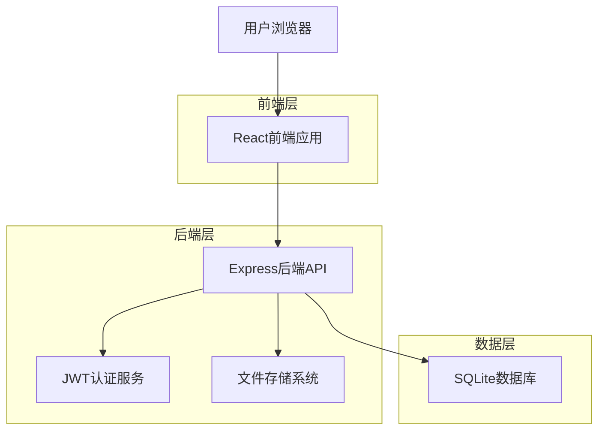
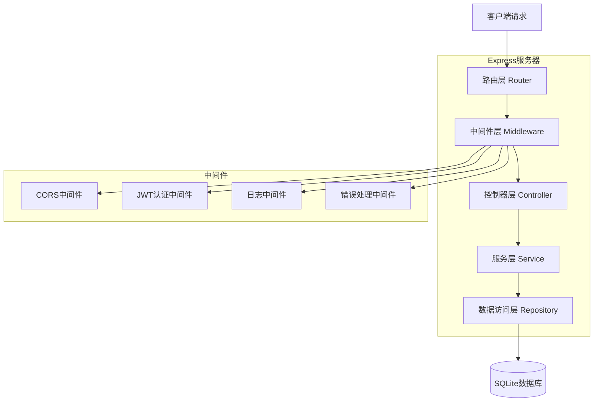
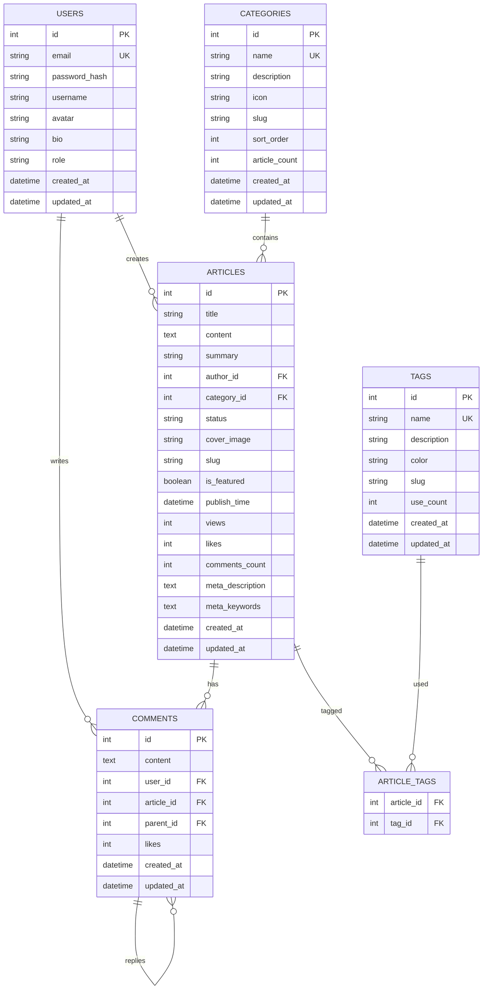

# 博客系统技术架构文档

## 1. Architecture design



## 2. Technology Description

* 前端: React\@18 + TypeScript + Tailwind CSS + Vite + React Router

* 后端: Express\@4 + TypeScript + JWT认证

* 数据库: SQLite\@3

* 开发工具: ESLint + Prettier + Husky

## 3. Route definitions

| Route              | Purpose               |
| ------------------ | --------------------- |
| /                  | 首页，展示文章列表和导航          |
| /login             | 登录页面，用户身份验证           |
| /register          | 注册页面，新用户注册            |
| /profile           | 用户中心，个人信息和文章管理        |
| /dashboard         | 用户仪表板，文章管理和数据概览       |
| /articles          | 文章列表页面，支持分类、标签筛选和搜索   |
| /articles/new      | 创建新文章页面               |
| /articles/:id      | 文章详情页面，显示文章内容和评论      |
| /articles/:id/edit | 编辑文章页面                |
| /write             | 文章编辑页，创建和编辑文章（兼容旧路由）  |
| /edit/:id          | 编辑指定文章（兼容旧路由）         |
| /categories        | 分类管理页面                |
| /categories/:id    | 特定分类的文章列表             |
| /category/:name    | 分类页面，显示特定分类的文章（兼容旧路由） |
| /tags              | 标签管理页面                |
| /tags/:id          | 特定标签的文章列表             |
| /tag/:name         | 标签页面，显示特定标签的文章（兼容旧路由） |
| /search            | 搜索页面，文章搜索功能           |
| /user/:id          | 用户公开资料页面              |
| /admin             | 管理员后台首页               |
| /admin/articles    | 文章管理后台                |
| /admin/categories  | 分类管理后台                |
| /admin/tags        | 标签管理后台                |
| /admin/users       | 用户管理后台                |
| /admin/comments    | 评论管理后台                |
| /about             | 关于页面，博客介绍             |

## 4. API definitions

### 4.1 Core API

**用户认证相关**

```
POST /api/auth/register
```

Request:

| Param Name | Param Type | isRequired | Description |
| ---------- | ---------- | ---------- | ----------- |
| email      | string     | true       | 用户邮箱地址      |
| password   | string     | true       | 用户密码        |
| username   | string     | true       | 用户昵称        |

Response:

| Param Name | Param Type | Description |
| ---------- | ---------- | ----------- |
| success    | boolean    | 注册是否成功      |
| message    | string     | 响应消息        |
| token      | string     | JWT令牌       |

```
POST /api/auth/login
```

Request:

| Param Name | Param Type | isRequired | Description |
| ---------- | ---------- | ---------- | ----------- |
| email      | string     | true       | 用户邮箱        |
| password   | string     | true       | 用户密码        |

Response:

| Param Name | Param Type | Description |
| ---------- | ---------- | ----------- |
| success    | boolean    | 登录是否成功      |
| token      | string     | JWT令牌       |
| user       | object     | 用户信息        |

**文章管理相关**

```
GET /api/articles
```

Query Parameters:

| Param Name | Param Type | isRequired | Description                               |
| ---------- | ---------- | ---------- | ----------------------------------------- |
| page       | number     | false      | 页码，默认1                                    |
| limit      | number     | false      | 每页数量，默认10                                 |
| category   | string     | false      | 分类筛选                                      |
| tag        | string     | false      | 标签筛选                                      |
| author     | string     | false      | 作者筛选                                      |
| status     | string     | false      | 状态筛选(draft/published/archived)            |
| sort       | string     | false      | 排序方式(created\_at/updated\_at/views/likes) |
| order      | string     | false      | 排序顺序(asc/desc)                            |
| search     | string     | false      | 搜索关键词                                     |

Response:

| Param Name | Param Type | Description |
| ---------- | ---------- | ----------- |
| articles   | array      | 文章列表        |
| total      | number     | 文章总数        |
| page       | number     | 当前页码        |
| totalPages | number     | 总页数         |
| filters    | object     | 当前筛选条件      |

```
POST /api/articles
```

Request:

| Param Name  | Param Type | isRequired | Description                   |
| ----------- | ---------- | ---------- | ----------------------------- |
| title       | string     | true       | 文章标题(1-100字符)                 |
| content     | string     | true       | 文章内容(Markdown格式)              |
| summary     | string     | false      | 文章摘要(最多200字符)                 |
| categoryId  | number     | false      | 分类ID                          |
| tags        | array      | false      | 标签ID数组                        |
| status      | string     | false      | 发布状态(draft/published/private) |
| coverImage  | string     | false      | 封面图片URL                       |
| publishTime | string     | false      | 定时发布时间                        |

Response:

| Param Name | Param Type | Description |
| ---------- | ---------- | ----------- |
| success    | boolean    | 创建是否成功      |
| article    | object     | 创建的文章信息     |
| message    | string     | 响应消息        |

```
GET /api/articles/:id
```

Response:

| Param Name  | Param Type | Description                |
| ----------- | ---------- | -------------------------- |
| id          | number     | 文章ID                       |
| title       | string     | 文章标题                       |
| content     | string     | 文章内容                       |
| summary     | string     | 文章摘要                       |
| author      | object     | 作者信息(id, username, avatar) |
| category    | object     | 分类信息(id, name)             |
| tags        | array      | 标签列表                       |
| status      | string     | 发布状态                       |
| coverImage  | string     | 封面图片                       |
| views       | number     | 阅读量                        |
| likes       | number     | 点赞数                        |
| createdAt   | string     | 创建时间                       |
| updatedAt   | string     | 更新时间                       |
| publishTime | string     | 发布时间                       |

```
PUT /api/articles/:id
```

Request: (同POST /api/articles)

Response:

| Param Name | Param Type | Description |
| ---------- | ---------- | ----------- |
| success    | boolean    | 更新是否成功      |
| article    | object     | 更新后的文章信息    |
| message    | string     | 响应消息        |

```
DELETE /api/articles/:id
```

Response:

| Param Name | Param Type | Description |
| ---------- | ---------- | ----------- |
| success    | boolean    | 删除是否成功      |
| message    | string     | 响应消息        |

```
POST /api/articles/:id/like
```

Response:

| Param Name | Param Type | Description |
| ---------- | ---------- | ----------- |
| success    | boolean    | 点赞是否成功      |
| likes      | number     | 当前点赞数       |
| isLiked    | boolean    | 当前用户是否已点赞   |

**分类管理相关**

```
GET /api/categories
```

Response:

| Param Name | Param Type | Description |
| ---------- | ---------- | ----------- |
| categories | array      | 分类列表        |
| total      | number     | 分类总数        |

```
POST /api/categories
```

Request:

| Param Name  | Param Type | isRequired | Description   |
| ----------- | ---------- | ---------- | ------------- |
| name        | string     | true       | 分类名称(1-20字符)  |
| description | string     | false      | 分类描述(最多100字符) |
| icon        | string     | false      | 分类图标          |
| sortOrder   | number     | false      | 排序权重          |

Response:

| Param Name | Param Type | Description |
| ---------- | ---------- | ----------- |
| success    | boolean    | 创建是否成功      |
| category   | object     | 创建的分类信息     |
| message    | string     | 响应消息        |

```
PUT /api/categories/:id
```

Request: (同POST /api/categories)

```
DELETE /api/categories/:id
```

Query Parameters:

| Param Name     | Param Type | isRequired | Description |
| -------------- | ---------- | ---------- | ----------- |
| moveToCategory | number     | false      | 将文章移动到的分类ID |

**标签管理相关**

```
GET /api/tags
```

Query Parameters:

| Param Name | Param Type | isRequired | Description                   |
| ---------- | ---------- | ---------- | ----------------------------- |
| sort       | string     | false      | 排序方式(name/useCount/createdAt) |
| search     | string     | false      | 搜索标签名称                        |

Response:

| Param Name | Param Type | Description |
| ---------- | ---------- | ----------- |
| tags       | array      | 标签列表        |
| total      | number     | 标签总数        |

```
POST /api/tags
```

Request:

| Param Name  | Param Type | isRequired | Description  |
| ----------- | ---------- | ---------- | ------------ |
| name        | string     | true       | 标签名称(1-15字符) |
| color       | string     | false      | 标签颜色(HEX格式)  |
| description | string     | false      | 标签描述(最多50字符) |

```
PUT /api/tags/:id
```

Request: (同POST /api/tags)

```
DELETE /api/tags/:id
```

```
POST /api/tags/merge
```

Request:

| Param Name   | Param Type | isRequired | Description |
| ------------ | ---------- | ---------- | ----------- |
| sourceTagIds | array      | true       | 要合并的标签ID数组  |
| targetTagId  | number     | true       | 目标标签ID      |

**搜索相关**

```
GET /api/search
```

Query Parameters:

| Param Name | Param Type | isRequired | Description                 |
| ---------- | ---------- | ---------- | --------------------------- |
| q          | string     | true       | 搜索关键词                       |
| type       | string     | false      | 搜索类型(all/title/content/tag) |
| category   | string     | false      | 分类筛选                        |
| tag        | string     | false      | 标签筛选                        |
| dateRange  | string     | false      | 时间范围(week/month/year)       |
| page       | number     | false      | 页码                          |
| limit      | number     | false      | 每页数量                        |

Response:

| Param Name  | Param Type | Description |
| ----------- | ---------- | ----------- |
| results     | array      | 搜索结果        |
| total       | number     | 结果总数        |
| suggestions | array      | 搜索建议        |
| highlights  | object     | 关键词高亮信息     |

**评论系统相关**

```
GET /api/articles/:id/comments
```

Response:

| Param Name | Param Type | Description |
| ---------- | ---------- | ----------- |
| comments   | array      | 评论列表        |
| total      | number     | 评论总数        |

```
POST /api/articles/:id/comments
```

Request:

| Param Name | Param Type | isRequired | Description |
| ---------- | ---------- | ---------- | ----------- |
| content    | string     | true       | 评论内容        |
| parentId   | number     | false      | 父评论ID(回复)   |

## 5. Server architecture diagram



## 6. Data model

### 6.1 Data model definition



### 6.2 Data Definition Language

**用户表 (users)**

```sql
-- 创建用户表
CREATE TABLE users (
  id INTEGER PRIMARY KEY AUTOINCREMENT,
  email VARCHAR(255) UNIQUE NOT NULL,
  password_hash VARCHAR(255) NOT NULL,
  username VARCHAR(100) NOT NULL,
  avatar VARCHAR(255) DEFAULT NULL,
  bio TEXT DEFAULT NULL,
  role VARCHAR(20) DEFAULT 'user' CHECK (role IN ('user', 'author', 'admin')),
  created_at DATETIME DEFAULT CURRENT_TIMESTAMP,
  updated_at DATETIME DEFAULT CURRENT_TIMESTAMP
);

-- 创建索引
CREATE INDEX idx_users_email ON users(email);
CREATE INDEX idx_users_username ON users(username);
```

**分类表 (categories)**

```sql
-- 创建分类表
CREATE TABLE categories (
  id INTEGER PRIMARY KEY AUTOINCREMENT,
  name VARCHAR(100) UNIQUE NOT NULL,
  description TEXT DEFAULT NULL,
  icon VARCHAR(100) DEFAULT NULL,
  slug VARCHAR(100) UNIQUE NOT NULL,
  sort_order INTEGER DEFAULT 0,
  article_count INTEGER DEFAULT 0,
  created_at DATETIME DEFAULT CURRENT_TIMESTAMP,
  updated_at DATETIME DEFAULT CURRENT_TIMESTAMP
);

-- 创建索引
CREATE INDEX idx_categories_slug ON categories(slug);
CREATE INDEX idx_categories_sort_order ON categories(sort_order);

-- 初始化分类数据
INSERT INTO categories (name, description, icon, slug, sort_order) VALUES
('技术', '技术相关文章', '💻', 'tech', 1),
('生活', '生活感悟和日常', '🌱', 'life', 2),
('读书', '读书笔记和书评', '📚', 'reading', 3),
('旅行', '旅行游记和攻略', '✈️', 'travel', 4),
('随笔', '随想和杂记', '✍️', 'essay', 5);
```

**标签表 (tags)**

```sql
-- 创建标签表
CREATE TABLE tags (
  id INTEGER PRIMARY KEY AUTOINCREMENT,
  name VARCHAR(50) UNIQUE NOT NULL,
  description TEXT DEFAULT NULL,
  color VARCHAR(7) DEFAULT '#3B82F6',
  slug VARCHAR(50) UNIQUE NOT NULL,
  use_count INTEGER DEFAULT 0,
  created_at DATETIME DEFAULT CURRENT_TIMESTAMP,
  updated_at DATETIME DEFAULT CURRENT_TIMESTAMP
);

-- 创建索引
CREATE INDEX idx_tags_slug ON tags(slug);
CREATE INDEX idx_tags_use_count ON tags(use_count DESC);
CREATE INDEX idx_tags_name ON tags(name);

-- 初始化标签数据
INSERT INTO tags (name, description, color, slug) VALUES
('JavaScript', 'JavaScript编程语言', '#F7DF1E', 'javascript'),
('React', 'React前端框架', '#61DAFB', 'react'),
('TypeScript', 'TypeScript编程语言', '#3178C6', 'typescript'),
('Node.js', 'Node.js后端技术', '#339933', 'nodejs'),
('前端', '前端开发技术', '#FF6B6B', 'frontend'),
('后端', '后端开发技术', '#4ECDC4', 'backend'),
('数据库', '数据库相关技术', '#FF9500', 'database'),
('算法', '算法和数据结构', '#8E44AD', 'algorithm'),
('设计模式', '软件设计模式', '#2ECC71', 'design-pattern'),
('性能优化', '性能优化技巧', '#E74C3C', 'performance'),
('开源项目', '开源项目分享', '#34495E', 'opensource'),
('学习笔记', '学习心得笔记', '#95A5A6', 'notes'),
('Vue.js', 'Vue.js前端框架', '#4FC08D', 'vuejs'),
('Python', 'Python编程语言', '#3776AB', 'python'),
('Docker', '容器化技术', '#2496ED', 'docker'),
('Git', '版本控制工具', '#F05032', 'git');
```

**文章表 (articles)**

```sql
-- 创建文章表
CREATE TABLE articles (
  id INTEGER PRIMARY KEY AUTOINCREMENT,
  title VARCHAR(255) NOT NULL,
  content TEXT NOT NULL,
  summary TEXT DEFAULT NULL,
  author_id INTEGER NOT NULL,
  category_id INTEGER DEFAULT NULL,
  status VARCHAR(20) DEFAULT 'draft' CHECK (status IN ('draft', 'published', 'archived', 'private')),
  cover_image VARCHAR(500) DEFAULT NULL,
  slug VARCHAR(255) UNIQUE DEFAULT NULL,
  is_featured BOOLEAN DEFAULT FALSE,
  publish_time DATETIME DEFAULT NULL,
  views INTEGER DEFAULT 0,
  likes INTEGER DEFAULT 0,
  comments_count INTEGER DEFAULT 0,
  meta_description TEXT DEFAULT NULL,
  meta_keywords TEXT DEFAULT NULL,
  created_at DATETIME DEFAULT CURRENT_TIMESTAMP,
  updated_at DATETIME DEFAULT CURRENT_TIMESTAMP,
  FOREIGN KEY (author_id) REFERENCES users(id) ON DELETE CASCADE,
  FOREIGN KEY (category_id) REFERENCES categories(id) ON DELETE SET NULL
);

-- 创建索引
CREATE INDEX idx_articles_author_id ON articles(author_id);
CREATE INDEX idx_articles_category_id ON articles(category_id);
CREATE INDEX idx_articles_status ON articles(status);
CREATE INDEX idx_articles_slug ON articles(slug);
CREATE INDEX idx_articles_is_featured ON articles(is_featured);
CREATE INDEX idx_articles_publish_time ON articles(publish_time DESC);
CREATE INDEX idx_articles_created_at ON articles(created_at DESC);
CREATE INDEX idx_articles_views ON articles(views DESC);
CREATE INDEX idx_articles_likes ON articles(likes DESC);

-- 创建全文搜索索引（如果支持）
-- CREATE VIRTUAL TABLE articles_fts USING fts5(title, content, summary);
```

**文章标签关联表 (article\_tags)**

```sql
-- 创建文章标签关联表
CREATE TABLE article_tags (
  article_id INTEGER NOT NULL,
  tag_id INTEGER NOT NULL,
  PRIMARY KEY (article_id, tag_id),
  FOREIGN KEY (article_id) REFERENCES articles(id) ON DELETE CASCADE,
  FOREIGN KEY (tag_id) REFERENCES tags(id) ON DELETE CASCADE
);
```

**评论表 (comments)**

```sql
-- 创建评论表
CREATE TABLE comments (
  id INTEGER PRIMARY KEY AUTOINCREMENT,
  content TEXT NOT NULL,
  user_id INTEGER NOT NULL,
  article_id INTEGER NOT NULL,
  parent_id INTEGER DEFAULT NULL,
  likes INTEGER DEFAULT 0,
  created_at DATETIME DEFAULT CURRENT_TIMESTAMP,
  updated_at DATETIME DEFAULT CURRENT_TIMESTAMP,
  FOREIGN KEY (user_id) REFERENCES users(id) ON DELETE CASCADE,
  FOREIGN KEY (article_id) REFERENCES articles(id) ON DELETE CASCADE,
  FOREIGN KEY (parent_id) REFERENCES comments(id) ON DELETE CASCADE
);

-- 创建索引
CREATE INDEX idx_comments_user_id ON comments(user_id);
CREATE INDEX idx_comments_article_id ON comments(article_id);
CREATE INDEX idx_comments_parent_id ON comments(parent_id);
CREATE INDEX idx_comments_created_at ON comments(created_at DESC);
```

**初始化用户数据**

```sql
-- 创建默认管理员账号
-- 密码: admin123 (BCrypt加密后的哈希值)
INSERT INTO users (email, password_hash, username, role, bio) VALUES
('admin@blog.com', '$2b$10$rOzJqQjQjQjQjQjQjQjQjOeKKF.Sb8z8z8z8z8z8z8z8z8z8z8z8z8', 'Admin', 'admin', '系统管理员'),
('demo@blog.com', '$2b$10$rOzJqQjQjQjQjQjQjQjQjOeKKF.Sb8z8z8z8z8z8z8z8z8z8z8z8z8', 'Demo用户', 'author', '演示博主账号'),
('user@blog.com', '$2b$10$rOzJqQjQjQjQjQjQjQjQjOeKKF.Sb8z8z8z8z8z8z8z8z8z8z8z8z8', '普通用户', 'user', '普通注册用户');

-- 创建示例文章
INSERT INTO articles (title, content, summary, author_id, category_id, status, views, likes) VALUES
('欢迎来到我的博客', '# 欢迎来到我的博客\n\n这是第一篇文章，用于测试博客系统的基本功能。\n\n## 功能特点\n\n- 支持Markdown编辑\n- 用户认证系统\n- 评论功能\n- 分类和标签\n\n希望你喜欢这个博客系统！', '博客系统的第一篇文章，介绍基本功能', 2, 1, 'published', 100, 5),
('React开发最佳实践', '# React开发最佳实践\n\n本文总结了React开发中的一些最佳实践...', 'React开发经验分享', 2, 1, 'published', 50, 3),
('我的读书笔记', '# 最近读的几本好书\n\n分享一些最近读过的技术书籍...', '技术书籍推荐和读书心得', 2, 3, 'draft', 0, 0);

-- 创建文章标签关联
INSERT INTO article_tags (article_id, tag_id) VALUES
(1, 1), (1, 2), -- 第一篇文章关联JavaScript和React标签
(2, 2), (2, 5), -- 第二篇文章关联React和前端标签
(3, 11); -- 第三篇文章关联学习笔记标签

-- 创建示例评论
INSERT INTO comments (content, user_id, article_id, likes) VALUES
('很棒的博客系统！期待更多功能', 3, 1, 2),
('界面很简洁，用户体验不错', 3, 1, 1),
('感谢分享，学到了很多', 3, 2, 3);
```

**触发器 - 自动更新时间戳**

```sql
-- 用户表更新时间触发器
CREATE TRIGGER update_users_timestamp 
  AFTER UPDATE ON users
  FOR EACH ROW
  BEGIN
    UPDATE users SET updated_at = CURRENT_TIMESTAMP WHERE id = NEW.id;
  END;

-- 文章表更新时间触发器
CREATE TRIGGER update_articles_timestamp 
  AFTER UPDATE ON articles
  FOR EACH ROW
  BEGIN
    UPDATE articles SET updated_at = CURRENT_TIMESTAMP WHERE id = NEW.id;
  END;

-- 评论表更新时间触发器
CREATE TRIGGER update_comments_timestamp 
  AFTER UPDATE ON comments
  FOR EACH ROW
  BEGIN
    UPDATE comments SET updated_at = CURRENT_TIMESTAMP WHERE id = NEW.id;
  END;
```

## 7. 默认账号信息

### 7.1 管理员账号

| 字段  | 值                | 说明             |
| --- | ---------------- | -------------- |
| 邮箱  | <admin@blog.com> | 管理员登录邮箱        |
| 密码  | admin123         | 默认密码（首次登录后请修改） |
| 用户名 | Admin            | 管理员显示名称        |
| 角色  | admin            | 拥有所有权限         |

### 7.2 演示账号

| 字段  | 值               | 说明         |
| --- | --------------- | ---------- |
| 邮箱  | <demo@blog.com> | 演示博主账号     |
| 密码  | demo123         | 演示密码       |
| 用户名 | Demo用户          | 演示博主名称     |
| 角色  | author          | 可发布文章和管理评论 |

### 7.3 测试账号

| 字段  | 值               | 说明     |
| --- | --------------- | ------ |
| 邮箱  | <user@blog.com> | 普通用户账号 |
| 密码  | user123         | 测试密码   |
| 用户名 | 普通用户            | 普通用户名称 |
| 角色  | user            | 基础用户权限 |

