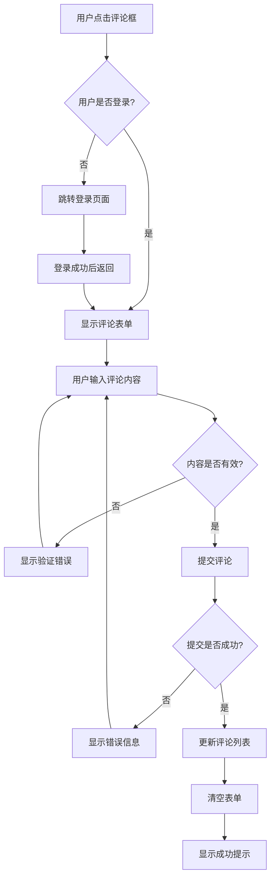
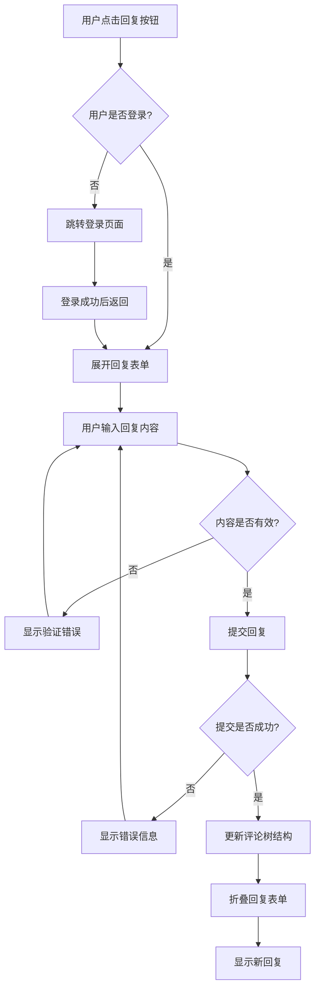
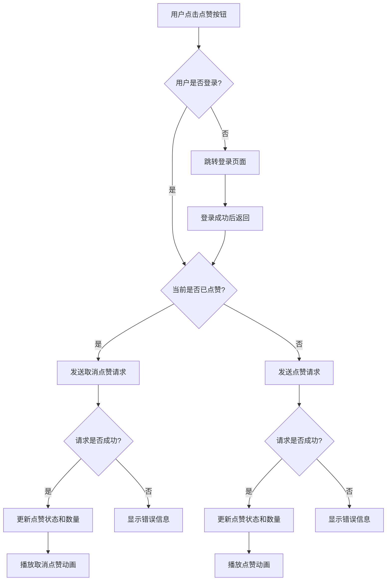

# 评论系统模块4.2技术文档

## 1. 模块概述

### 1.1 模块目标
实现博客系统的评论前端组件，提供完整的评论交互功能，包括评论展示、发表、回复、点赞和删除等操作，确保良好的用户体验和响应式设计。

### 1.2 核心功能
- 评论列表展示（支持嵌套结构）
- 评论发表表单
- 评论回复功能
- 评论点赞/取消点赞
- 评论删除操作
- 评论分页加载
- 响应式UI设计
- 动画交互效果

### 1.3 技术要求
- 遵循现有组件设计规范
- 使用TypeScript严格类型检查
- 集成Zustand状态管理
- 采用Tailwind CSS样式系统
- 实现响应式布局
- 提供良好的用户体验

## 2. 组件架构设计

### 2.1 组件层次结构

```
CommentSection (评论区域)
├── CommentForm (评论表单)
├── CommentList (评论列表)
│   ├── CommentItem (评论项)
│   │   ├── CommentContent (评论内容)
│   │   ├── CommentActions (评论操作)
│   │   └── CommentReplies (回复列表)
│   │       └── CommentItem (递归回复项)
│   └── CommentPagination (分页组件)
└── CommentStats (评论统计)
```

### 2.2 组件职责划分

| 组件名 | 职责 | 复用性 |
|--------|------|--------|
| CommentSection | 评论区域容器，管理整体状态 | 低 |
| CommentForm | 评论发表表单，处理输入和提交 | 中 |
| CommentList | 评论列表容器，处理分页和排序 | 中 |
| CommentItem | 单个评论展示，处理交互操作 | 高 |
| CommentContent | 评论内容展示，支持富文本 | 高 |
| CommentActions | 评论操作按钮（点赞、回复、删除） | 高 |
| CommentReplies | 回复列表容器，支持嵌套展示 | 中 |
| CommentPagination | 分页控件，支持加载更多 | 高 |
| CommentStats | 评论统计信息展示 | 中 |

## 3. 组件接口设计

### 3.1 TypeScript类型定义

```typescript
// 评论数据接口
interface Comment {
  id: number;
  content: string;
  user_id: number;
  article_id: number;
  parent_id: number | null;
  likes: number;
  created_at: string;
  updated_at: string;
  user: {
    id: number;
    username: string;
    avatar?: string;
  };
  replies?: Comment[];
  isLiked?: boolean; // 当前用户是否已点赞
  canDelete?: boolean; // 当前用户是否可删除
}

// 评论表单数据
interface CommentFormData {
  content: string;
  parent_id?: number;
}

// 评论列表查询参数
interface CommentQuery {
  article_id: number;
  page?: number;
  limit?: number;
  sort?: 'created_at' | 'likes';
  order?: 'asc' | 'desc';
}

// 评论操作类型
type CommentAction = 'like' | 'unlike' | 'reply' | 'delete' | 'edit';

// 评论状态
interface CommentState {
  comments: Comment[];
  loading: boolean;
  error: string | null;
  pagination: {
    page: number;
    limit: number;
    total: number;
    totalPages: number;
  };
  replyingTo: number | null;
  editingComment: number | null;
}
```

### 3.2 组件Props定义

```typescript
// CommentSection Props
interface CommentSectionProps {
  articleId: number;
  initialComments?: Comment[];
  allowAnonymous?: boolean;
  maxDepth?: number;
  pageSize?: number;
  className?: string;
}

// CommentForm Props
interface CommentFormProps {
  articleId: number;
  parentId?: number;
  placeholder?: string;
  onSubmit: (data: CommentFormData) => Promise<void>;
  onCancel?: () => void;
  loading?: boolean;
  className?: string;
}

// CommentList Props
interface CommentListProps {
  comments: Comment[];
  loading?: boolean;
  onLoadMore?: () => void;
  hasMore?: boolean;
  className?: string;
}

// CommentItem Props
interface CommentItemProps {
  comment: Comment;
  depth?: number;
  maxDepth?: number;
  onReply: (commentId: number) => void;
  onLike: (commentId: number) => void;
  onDelete: (commentId: number) => void;
  className?: string;
}

// CommentActions Props
interface CommentActionsProps {
  comment: Comment;
  onReply: () => void;
  onLike: () => void;
  onDelete: () => void;
  loading?: boolean;
  className?: string;
}
```

## 4. 状态管理方案

### 4.1 评论Store设计

```typescript
// 评论状态管理 - commentStore.ts
import { create } from 'zustand';
import { persist } from 'zustand/middleware';

interface CommentStore {
  // 状态
  commentsByArticle: Record<number, Comment[]>;
  loading: boolean;
  error: string | null;
  pagination: Record<number, PaginationInfo>;
  
  // 操作方法
  fetchComments: (articleId: number, query?: CommentQuery) => Promise<void>;
  addComment: (articleId: number, comment: CommentFormData) => Promise<void>;
  replyToComment: (articleId: number, parentId: number, content: string) => Promise<void>;
  likeComment: (articleId: number, commentId: number) => Promise<void>;
  deleteComment: (articleId: number, commentId: number) => Promise<void>;
  
  // 辅助方法
  getComments: (articleId: number) => Comment[];
  getCommentById: (articleId: number, commentId: number) => Comment | null;
  updateComment: (articleId: number, commentId: number, updates: Partial<Comment>) => void;
  setLoading: (loading: boolean) => void;
  setError: (error: string | null) => void;
}

// 分页信息接口
interface PaginationInfo {
  page: number;
  limit: number;
  total: number;
  totalPages: number;
  hasMore: boolean;
}
```

### 4.2 本地状态管理

```typescript
// 组件内部状态管理
const useCommentState = (articleId: number) => {
  const [replyingTo, setReplyingTo] = useState<number | null>(null);
  const [editingComment, setEditingComment] = useState<number | null>(null);
  const [expandedReplies, setExpandedReplies] = useState<Set<number>>(new Set());
  const [likeAnimations, setLikeAnimations] = useState<Set<number>>(new Set());
  
  // 切换回复状态
  const toggleReply = (commentId: number) => {
    setReplyingTo(replyingTo === commentId ? null : commentId);
  };
  
  // 切换回复展开状态
  const toggleReplies = (commentId: number) => {
    const newExpanded = new Set(expandedReplies);
    if (newExpanded.has(commentId)) {
      newExpanded.delete(commentId);
    } else {
      newExpanded.add(commentId);
    }
    setExpandedReplies(newExpanded);
  };
  
  return {
    replyingTo,
    editingComment,
    expandedReplies,
    likeAnimations,
    toggleReply,
    toggleReplies,
    setEditingComment,
    setLikeAnimations
  };
};
```

## 5. UI/UX设计规范

### 5.1 设计原则

- **一致性**: 与现有系统UI保持一致的设计语言
- **可访问性**: 支持键盘导航和屏幕阅读器
- **响应式**: 适配桌面、平板和移动设备
- **性能**: 优化渲染性能，支持虚拟滚动
- **交互性**: 提供即时反馈和流畅动画

### 5.2 视觉设计规范

```css
/* 评论区域样式变量 */
:root {
  --comment-bg: #ffffff;
  --comment-border: #e5e7eb;
  --comment-text: #374151;
  --comment-meta: #6b7280;
  --comment-hover: #f9fafb;
  --comment-reply-bg: #f8fafc;
  --comment-action-color: #6b7280;
  --comment-action-hover: #374151;
  --comment-like-color: #ef4444;
  --comment-reply-border: #e2e8f0;
}

/* 评论嵌套层级样式 */
.comment-level-0 { margin-left: 0; }
.comment-level-1 { margin-left: 2rem; border-left: 2px solid var(--comment-reply-border); }
.comment-level-2 { margin-left: 4rem; border-left: 2px solid var(--comment-reply-border); }
.comment-level-3 { margin-left: 6rem; border-left: 2px solid var(--comment-reply-border); }

/* 响应式断点 */
@media (max-width: 768px) {
  .comment-level-1 { margin-left: 1rem; }
  .comment-level-2 { margin-left: 2rem; }
  .comment-level-3 { margin-left: 3rem; }
}
```

### 5.3 组件样式规范

```typescript
// Tailwind CSS类名常量
const COMMENT_STYLES = {
  // 容器样式
  section: 'mt-8 bg-white rounded-lg shadow-sm border',
  header: 'p-6 border-b',
  content: 'p-6',
  
  // 评论项样式
  item: 'mb-4 transition-all duration-200',
  itemContent: 'bg-gray-50 rounded-lg p-4 hover:bg-gray-100',
  itemReply: 'ml-8 border-l-2 border-gray-200 pl-4',
  
  // 用户信息样式
  avatar: 'w-8 h-8 bg-blue-500 rounded-full flex items-center justify-center text-white text-sm font-medium',
  username: 'font-medium text-gray-900',
  timestamp: 'text-xs text-gray-500',
  
  // 操作按钮样式
  actionButton: 'p-2 text-gray-400 hover:text-gray-600 transition-colors',
  likeButton: 'p-2 text-gray-400 hover:text-red-500 transition-colors',
  likeButtonActive: 'p-2 text-red-500 hover:text-red-600 transition-colors',
  deleteButton: 'p-2 text-gray-400 hover:text-red-600 transition-colors',
  
  // 表单样式
  form: 'space-y-4',
  textarea: 'w-full border border-gray-300 rounded-lg px-3 py-2 focus:ring-2 focus:ring-blue-500 focus:border-transparent resize-none',
  submitButton: 'px-4 py-2 bg-blue-600 text-white rounded-lg hover:bg-blue-700 disabled:opacity-50 disabled:cursor-not-allowed transition-colors',
  cancelButton: 'px-4 py-2 text-gray-600 hover:text-gray-800 transition-colors',
  
  // 加载状态样式
  loading: 'flex justify-center py-8',
  spinner: 'animate-spin rounded-full h-6 w-6 border-b-2 border-blue-600',
  
  // 空状态样式
  empty: 'text-center py-8 text-gray-500',
};
```

### 5.4 动画效果设计

```typescript
// 动画配置
const ANIMATIONS = {
  // 点赞动画
  like: {
    scale: [1, 1.2, 1],
    transition: { duration: 0.3, ease: 'easeInOut' }
  },
  
  // 评论出现动画
  commentAppear: {
    opacity: [0, 1],
    y: [20, 0],
    transition: { duration: 0.4, ease: 'easeOut' }
  },
  
  // 回复展开动画
  replyExpand: {
    height: ['0px', 'auto'],
    opacity: [0, 1],
    transition: { duration: 0.3, ease: 'easeInOut' }
  },
  
  // 删除动画
  commentRemove: {
    opacity: [1, 0],
    x: [0, -100],
    transition: { duration: 0.3, ease: 'easeIn' }
  }
};
```

## 6. 用户交互流程

### 6.1 评论发表流程



### 6.2 评论回复流程



### 6.3 评论点赞流程



## 7. API集成方案

### 7.1 API服务封装

```typescript
// commentAPI.ts - 评论API服务
import { authAPI } from '../store/authStore';

const API_BASE_URL = 'http://localhost:3001/api';

export const commentAPI = {
  // 获取评论列表
  getComments: async (query: CommentQuery): Promise<{ comments: Comment[], pagination: PaginationInfo }> => {
    const params = new URLSearchParams();
    Object.entries(query).forEach(([key, value]) => {
      if (value !== undefined) {
        params.append(key, value.toString());
      }
    });
    
    const response = await fetch(`${API_BASE_URL}/comments?${params}`);
    const data = await response.json();
    
    if (!data.success) {
      throw new Error(data.message || '获取评论失败');
    }
    
    return data.data;
  },
  
  // 创建评论
  createComment: async (commentData: CommentFormData): Promise<Comment> => {
    const response = await authAPI.authenticatedFetch(`${API_BASE_URL}/comments`, {
      method: 'POST',
      headers: {
        'Content-Type': 'application/json',
      },
      body: JSON.stringify(commentData),
    });
    
    const data = await response.json();
    
    if (!data.success) {
      throw new Error(data.message || '发表评论失败');
    }
    
    return data.data.comment;
  },
  
  // 回复评论
  replyComment: async (commentId: number, content: string): Promise<Comment> => {
    const response = await authAPI.authenticatedFetch(`${API_BASE_URL}/comments/${commentId}/reply`, {
      method: 'POST',
      headers: {
        'Content-Type': 'application/json',
      },
      body: JSON.stringify({ content }),
    });
    
    const data = await response.json();
    
    if (!data.success) {
      throw new Error(data.message || '回复评论失败');
    }
    
    return data.data.comment;
  },
  
  // 点赞评论
  likeComment: async (commentId: number): Promise<{ liked: boolean, likes: number }> => {
    const response = await authAPI.authenticatedFetch(`${API_BASE_URL}/comments/${commentId}/like`, {
      method: 'POST',
    });
    
    const data = await response.json();
    
    if (!data.success) {
      throw new Error(data.message || '点赞操作失败');
    }
    
    return data.data;
  },
  
  // 删除评论
  deleteComment: async (commentId: number): Promise<void> => {
    const response = await authAPI.authenticatedFetch(`${API_BASE_URL}/comments/${commentId}`, {
      method: 'DELETE',
    });
    
    const data = await response.json();
    
    if (!data.success) {
      throw new Error(data.message || '删除评论失败');
    }
  },
};
```

### 7.2 错误处理机制

```typescript
// 错误处理工具
export const handleCommentError = (error: any): string => {
  if (error.response) {
    // API返回的错误
    switch (error.response.status) {
      case 401:
        return '请先登录后再进行操作';
      case 403:
        return '您没有权限进行此操作';
      case 404:
        return '评论不存在或已被删除';
      case 429:
        return '操作过于频繁，请稍后再试';
      default:
        return error.response.data?.message || '操作失败，请重试';
    }
  } else if (error.request) {
    // 网络错误
    return '网络连接失败，请检查网络设置';
  } else {
    // 其他错误
    return error.message || '未知错误，请重试';
  }
};

// 重试机制
export const withRetry = async <T>(
  fn: () => Promise<T>,
  maxRetries: number = 3,
  delay: number = 1000
): Promise<T> => {
  let lastError: any;
  
  for (let i = 0; i <= maxRetries; i++) {
    try {
      return await fn();
    } catch (error) {
      lastError = error;
      if (i < maxRetries) {
        await new Promise(resolve => setTimeout(resolve, delay * Math.pow(2, i)));
      }
    }
  }
  
  throw lastError;
};
```

## 8. 性能优化方案

### 8.1 渲染优化

```typescript
// 虚拟滚动实现
import { FixedSizeList as List } from 'react-window';

const VirtualCommentList: React.FC<{ comments: Comment[] }> = ({ comments }) => {
  const Row = ({ index, style }: { index: number; style: React.CSSProperties }) => (
    <div style={style}>
      <CommentItem comment={comments[index]} />
    </div>
  );
  
  return (
    <List
      height={600}
      itemCount={comments.length}
      itemSize={120}
      width="100%"
    >
      {Row}
    </List>
  );
};

// 评论项记忆化
const CommentItem = React.memo<CommentItemProps>(({ comment, ...props }) => {
  // 组件实现
}, (prevProps, nextProps) => {
  // 自定义比较函数
  return (
    prevProps.comment.id === nextProps.comment.id &&
    prevProps.comment.likes === nextProps.comment.likes &&
    prevProps.comment.isLiked === nextProps.comment.isLiked
  );
});
```

### 8.2 数据缓存策略

```typescript
// 评论数据缓存
const useCommentCache = () => {
  const cache = useRef<Map<string, { data: any; timestamp: number }>>(new Map());
  const CACHE_DURATION = 5 * 60 * 1000; // 5分钟
  
  const getCachedData = (key: string) => {
    const cached = cache.current.get(key);
    if (cached && Date.now() - cached.timestamp < CACHE_DURATION) {
      return cached.data;
    }
    return null;
  };
  
  const setCachedData = (key: string, data: any) => {
    cache.current.set(key, {
      data,
      timestamp: Date.now()
    });
  };
  
  return { getCachedData, setCachedData };
};
```

### 8.3 懒加载实现

```typescript
// 图片懒加载
const LazyAvatar: React.FC<{ src?: string; alt: string }> = ({ src, alt }) => {
  const [isLoaded, setIsLoaded] = useState(false);
  const [isInView, setIsInView] = useState(false);
  const imgRef = useRef<HTMLImageElement>(null);
  
  useEffect(() => {
    const observer = new IntersectionObserver(
      ([entry]) => {
        if (entry.isIntersecting) {
          setIsInView(true);
          observer.disconnect();
        }
      },
      { threshold: 0.1 }
    );
    
    if (imgRef.current) {
      observer.observe(imgRef.current);
    }
    
    return () => observer.disconnect();
  }, []);
  
  return (
    <div ref={imgRef} className="w-8 h-8 rounded-full overflow-hidden">
      {isInView && (
         setIsLoaded(true)}
          className={`w-full h-full object-cover transition-opacity duration-300 ${
            isLoaded ? 'opacity-100' : 'opacity-0'
          }`}
        />
      )}
    </div>
  );
};
```

## 9. 测试策略

### 9.1 单元测试

```typescript
// CommentItem.test.tsx
import { render, screen, fireEvent, waitFor } from '@testing-library/react';
import { CommentItem } from '../CommentItem';

describe('CommentItem', () => {
  const mockComment: Comment = {
    id: 1,
    content: '这是一条测试评论',
    user: { id: 1, username: '测试用户' },
    likes: 5,
    created_at: '2024-01-01T00:00:00Z',
    // ... 其他属性
  };
  
  const mockProps = {
    comment: mockComment,
    onReply: jest.fn(),
    onLike: jest.fn(),
    onDelete: jest.fn(),
  };
  
  test('应该正确渲染评论内容', () => {
    render(<CommentItem {...mockProps} />);
    expect(screen.getByText('这是一条测试评论')).toBeInTheDocument();
    expect(screen.getByText('测试用户')).toBeInTheDocument();
  });
  
  test('点击点赞按钮应该调用onLike', async () => {
    render(<CommentItem {...mockProps} />);
    const likeButton = screen.getByRole('button', { name: /点赞/ });
    fireEvent.click(likeButton);
    await waitFor(() => {
      expect(mockProps.onLike).toHaveBeenCalledWith(1);
    });
  });
  
  test('应该正确显示点赞数量', () => {
    render(<CommentItem {...mockProps} />);
    expect(screen.getByText('5')).toBeInTheDocument();
  });
});
```

### 9.2 集成测试

```typescript
// CommentSection.integration.test.tsx
import { render, screen, fireEvent, waitFor } from '@testing-library/react';
import { CommentSection } from '../CommentSection';
import { commentAPI } from '../../services/commentAPI';

// Mock API
jest.mock('../../services/commentAPI');
const mockedCommentAPI = commentAPI as jest.Mocked<typeof commentAPI>;

describe('CommentSection Integration', () => {
  beforeEach(() => {
    mockedCommentAPI.getComments.mockResolvedValue({
      comments: [],
      pagination: { page: 1, limit: 20, total: 0, totalPages: 0, hasMore: false }
    });
  });
  
  test('应该能够完整地发表评论', async () => {
    const newComment = {
      id: 1,
      content: '新评论',
      user: { id: 1, username: '用户' },
      likes: 0,
      created_at: new Date().toISOString(),
    };
    
    mockedCommentAPI.createComment.mockResolvedValue(newComment);
    
    render(<CommentSection articleId={1} />);
    
    // 输入评论内容
    const textarea = screen.getByPlaceholderText('写下你的评论...');
    fireEvent.change(textarea, { target: { value: '新评论' } });
    
    // 提交评论
    const submitButton = screen.getByRole('button', { name: '发表评论' });
    fireEvent.click(submitButton);
    
    // 验证API调用
    await waitFor(() => {
      expect(mockedCommentAPI.createComment).toHaveBeenCalledWith({
        content: '新评论',
        article_id: 1
      });
    });
    
    // 验证评论出现在列表中
    await waitFor(() => {
      expect(screen.getByText('新评论')).toBeInTheDocument();
    });
  });
});
```

### 9.3 E2E测试

```typescript
// comment.e2e.test.ts
import { test, expect } from '@playwright/test';

test.describe('评论功能', () => {
  test.beforeEach(async ({ page }) => {
    // 登录用户
    await page.goto('/login');
    await page.fill('[data-testid="email"]', 'test@example.com');
    await page.fill('[data-testid="password"]', 'password');
    await page.click('[data-testid="login-button"]');
    
    // 导航到文章页面
    await page.goto('/articles/1');
  });
  
  test('用户可以发表评论', async ({ page }) => {
    // 输入评论
    await page.fill('[data-testid="comment-textarea"]', '这是一条测试评论');
    
    // 提交评论
    await page.click('[data-testid="submit-comment"]');
    
    // 验证评论出现
    await expect(page.locator('text=这是一条测试评论')).toBeVisible();
  });
  
  test('用户可以回复评论', async ({ page }) => {
    // 点击回复按钮
    await page.click('[data-testid="reply-button"]').first();
    
    // 输入回复内容
    await page.fill('[data-testid="reply-textarea"]', '这是一条回复');
    
    // 提交回复
    await page.click('[data-testid="submit-reply"]');
    
    // 验证回复出现
    await expect(page.locator('text=这是一条回复')).toBeVisible();
  });
  
  test('用户可以点赞评论', async ({ page }) => {
    // 获取初始点赞数
    const initialLikes = await page.textContent('[data-testid="like-count"]');
    
    // 点击点赞按钮
    await page.click('[data-testid="like-button"]');
    
    // 验证点赞数增加
    await expect(page.locator('[data-testid="like-count"]')).not.toHaveText(initialLikes || '0');
  });
});
```

## 10. 部署和维护

### 10.1 构建优化

```typescript
// vite.config.ts 优化配置
export default defineConfig({
  build: {
    rollupOptions: {
      output: {
        manualChunks: {
          // 将评论相关组件打包到单独的chunk
          comments: [
            './src/components/CommentSection.tsx',
            './src/components/CommentList.tsx',
            './src/components/CommentItem.tsx',
            './src/components/CommentForm.tsx',
          ],
        },
      },
    },
    // 启用代码分割
    chunkSizeWarningLimit: 1000,
  },
});
```

### 10.2 监控和分析

```typescript
// 性能监控
const usePerformanceMonitor = () => {
  useEffect(() => {
    // 监控评论加载时间
    const startTime = performance.now();
    
    return () => {
      const endTime = performance.now();
      const loadTime = endTime - startTime;
      
      // 发送性能数据
      if (loadTime > 1000) {
        console.warn(`评论组件加载时间过长: ${loadTime}ms`);
      }
    };
  }, []);
};

// 错误边界
class CommentErrorBoundary extends React.Component {
  constructor(props: any) {
    super(props);
    this.state = { hasError: false };
  }
  
  static getDerivedStateFromError(error: any) {
    return { hasError: true };
  }
  
  componentDidCatch(error: any, errorInfo: any) {
    // 记录错误信息
    console.error('评论组件错误:', error, errorInfo);
  }
  
  render() {
    if (this.state.hasError) {
      return (
        <div className="text-center py-8">
          <p className="text-gray-500">评论加载失败，请刷新页面重试</p>
        </div>
      );
    }
    
    return this.props.children;
  }
}
```

### 10.3 可访问性支持

```typescript
// 键盘导航支持
const useKeyboardNavigation = () => {
  const handleKeyDown = (event: KeyboardEvent) => {
    switch (event.key) {
      case 'Enter':
        if (event.ctrlKey || event.metaKey) {
          // Ctrl+Enter 提交评论
          event.preventDefault();
          // 触发提交逻辑
        }
        break;
      case 'Escape':
        // ESC 取消回复
        event.preventDefault();
        // 触发取消逻辑
        break;
    }
  };
  
  useEffect(() => {
    document.addEventListener('keydown', handleKeyDown);
    return () => document.removeEventListener('keydown', handleKeyDown);
  }, []);
};

// ARIA标签支持
const CommentItemAccessible: React.FC<CommentItemProps> = ({ comment }) => {
  return (
    <article
      role="article"
      aria-labelledby={`comment-${comment.id}-author`}
      aria-describedby={`comment-${comment.id}-content`}
    >
      <header>
        <h3 id={`comment-${comment.id}-author`} className="sr-only">
          {comment.user.username}的评论
        </h3>
      </header>
      <div id={`comment-${comment.id}-content`}>
        {comment.content}
      </div>
      <footer>
        <button
          aria-label={`点赞${comment.user.username}的评论，当前${comment.likes}个赞`}
          onClick={() => handleLike(comment.id)}
        >
          <Heart className="w-4 h-4" />
          {comment.likes}
        </button>
      </footer>
    </article>
  );
};
```

## 11. 后续优化方向

### 11.1 功能扩展

- **富文本编辑器**: 支持Markdown、表情符号、@用户等
- **评论搜索**: 实现评论内容全文搜索
- **评论举报**: 添加举报功能和审核机制
- **实时通知**: WebSocket实时评论通知
- **评论导出**: 支持评论数据导出

### 11.2 性能优化

- **CDN加速**: 静态资源CDN分发
- **服务端渲染**: SSR提升首屏加载速度
- **预加载策略**: 智能预加载相关评论
- **图片优化**: WebP格式、响应式图片
- **缓存策略**: 多级缓存优化

### 11.3 用户体验

- **离线支持**: PWA离线评论功能
- **多语言支持**: 国际化i18n
- **主题定制**: 深色模式、主题切换
- **无障碍优化**: 更好的屏幕阅读器支持
- **手势操作**: 移动端手势交互

### 11.4 技术升级

- **React 18**: 并发特性、Suspense
- **TypeScript 5**: 最新类型系统特性
- **Vite 5**: 构建工具升级
- **测试覆盖**: 提升测试覆盖率到95%+
- **性能监控**: 完善的性能监控体系

---

本文档为评论系统模块4.2的完整技术指导，涵盖了从组件设计到部署维护的全流程。开发团队应严格按照此文档进行实现，确保代码质量和用户体验。