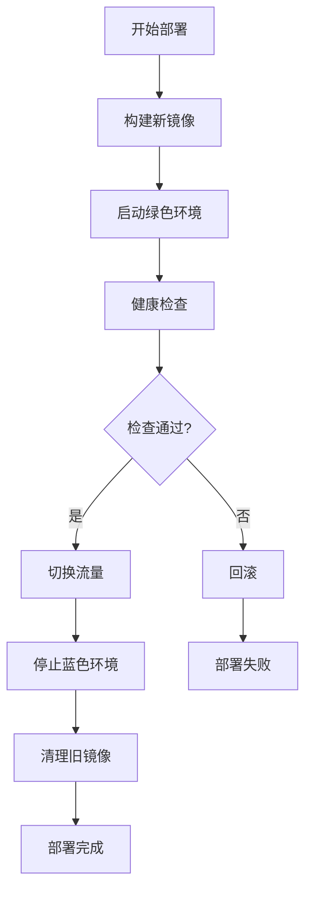
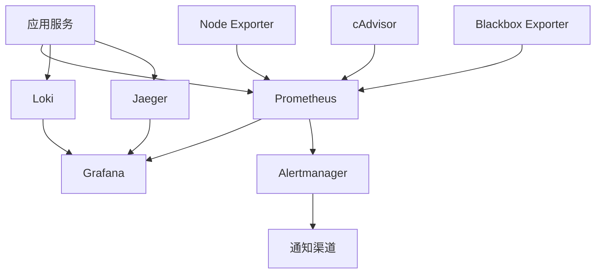

# 博客系统部署指南

## 目录

1. [概述](#概述)
2. [环境要求](#环境要求)
3. [快速开始](#快速开始)
4. [部署策略](#部署策略)
5. [环境配置](#环境配置)
6. [监控和日志](#监控和日志)
7. [故障排除](#故障排除)
8. [运维操作](#运维操作)
9. [安全考虑](#安全考虑)
10. [性能优化](#性能优化)

## 概述

博客系统采用现代化的容器化部署方案，支持多环境部署和零停机更新。系统包含以下组件：

- **前端应用** (React + Vite)
- **后端API** (Node.js + Express)
- **数据库** (PostgreSQL)
- **缓存** (Redis)
- **反向代理** (Nginx)
- **监控系统** (Prometheus + Grafana + Loki)
- **分布式追踪** (Jaeger)

## 环境要求

### 系统要求

- **操作系统**: Linux (推荐 Ubuntu 20.04+), macOS, Windows 10+
- **CPU**: 最少 2 核心，推荐 4 核心
- **内存**: 最少 4GB，推荐 8GB
- **存储**: 最少 20GB 可用空间
- **网络**: 稳定的互联网连接

### 软件依赖

- **Docker**: 20.10+
- **Docker Compose**: 2.0+
- **Git**: 2.20+
- **Node.js**: 18+ (开发环境)
- **npm/pnpm**: 最新版本

### 端口要求

| 服务 | 端口 | 描述 |
|------|------|------|
| 前端应用 | 3000/3001 | React 应用 |
| 后端API | 5000/5001 | Express API |
| Nginx | 80/81 | 反向代理 |
| PostgreSQL | 5432 | 数据库 |
| Redis | 6379 | 缓存 |
| Prometheus | 9090 | 指标收集 |
| Grafana | 3000 | 监控面板 |
| Jaeger | 16686 | 分布式追踪 |
| Loki | 3100 | 日志聚合 |

## 快速开始

### 1. 克隆项目

```bash
git clone <repository-url>
cd blog-system
```

### 2. 环境配置

```bash
# 复制环境配置文件
cp .env.example .env.development
cp .env.example .env.production

# 编辑配置文件
vim .env.production
```

### 3. 开发环境启动

```bash
# 安装依赖
npm install

# 启动开发服务器
npm run dev
```

### 4. 生产环境部署

```bash
# 构建和启动生产环境
./scripts/deploy.sh production

# 或使用零停机部署
./scripts/zero-downtime-deploy.sh
```

## 部署策略

### 蓝绿部署

系统支持蓝绿部署策略，实现零停机更新：

1. **蓝色环境**: 当前生产环境
2. **绿色环境**: 新版本部署环境
3. **流量切换**: 健康检查通过后切换流量
4. **回滚机制**: 出现问题时快速回滚

#### 蓝绿部署流程



### 滚动更新

对于无状态服务，支持滚动更新策略：

```yaml
strategy:
  type: RollingUpdate
  rollingUpdate:
    maxUnavailable: 1
    maxSurge: 1
```

## 环境配置

### 开发环境 (.env.development)

```env
# 应用配置
ENVIRONMENT=development
NODE_ENV=development
PORT=3000
API_PORT=5000

# 数据库配置
DB_HOST=localhost
DB_PORT=5432
DB_NAME=blog_dev
DB_USER=postgres
DB_PASSWORD=password

# Redis配置
REDIS_HOST=localhost
REDIS_PORT=6379
REDIS_PASSWORD=

# JWT配置
JWT_SECRET=your-dev-secret-key
JWT_EXPIRES_IN=7d

# 日志配置
LOG_LEVEL=debug
LOG_FORMAT=dev

# 监控配置
MONITORING_ENABLED=true
METRICS_PORT=9464
```

### 生产环境 (.env.production)

```env
# 应用配置
ENVIRONMENT=production
NODE_ENV=production
PORT=3000
API_PORT=5000

# 数据库配置
DB_HOST=postgres
DB_PORT=5432
DB_NAME=blog_prod
DB_USER=blog_user
DB_PASSWORD=${DB_PASSWORD}
DB_SSL=true
DB_POOL_MIN=2
DB_POOL_MAX=10

# Redis配置
REDIS_HOST=redis
REDIS_PORT=6379
REDIS_PASSWORD=${REDIS_PASSWORD}
REDIS_CLUSTER_MODE=false

# JWT配置
JWT_SECRET=${JWT_SECRET}
JWT_EXPIRES_IN=24h

# 安全配置
CORS_ORIGIN=${CORS_ORIGIN}
RATE_LIMIT_WINDOW=15
RATE_LIMIT_MAX=100

# 日志配置
LOG_LEVEL=info
LOG_FORMAT=json
LOG_FILE=/var/log/blog/app.log

# 监控配置
MONITORING_ENABLED=true
METRICS_PORT=9464
HEALTH_CHECK_INTERVAL=30

# 性能配置
CACHE_TTL=3600
SESSION_TIMEOUT=1800
FILE_UPLOAD_LIMIT=10MB

# 邮件配置
SMTP_HOST=${SMTP_HOST}
SMTP_PORT=${SMTP_PORT}
SMTP_USER=${SMTP_USER}
SMTP_PASS=${SMTP_PASS}
```

### 测试环境 (.env.testing)

```env
# 应用配置
ENVIRONMENT=testing
NODE_ENV=test
PORT=3002
API_PORT=5002

# 数据库配置
DB_HOST=localhost
DB_PORT=5433
DB_NAME=blog_test
DB_USER=test_user
DB_PASSWORD=test_password

# 测试配置
TEST_TIMEOUT=30000
TEST_PARALLEL=true
COVERAGE_THRESHOLD=80

# 模拟配置
MOCK_EXTERNAL_APIS=true
MOCK_EMAIL_SERVICE=true
```

## 监控和日志

### 监控系统架构



### 启动监控系统

```bash
# 启动完整监控堆栈
./scripts/start-monitoring.sh

# 检查监控状态
./scripts/monitoring-status.sh

# 停止监控系统
./scripts/stop-monitoring.sh
```

### 监控面板访问

- **Grafana**: http://localhost:3000 (admin/admin)
- **Prometheus**: http://localhost:9090
- **Jaeger**: http://localhost:16686
- **Alertmanager**: http://localhost:9093

### 关键指标

#### 应用指标

- **响应时间**: API 响应时间分布
- **错误率**: 4xx/5xx 错误率
- **吞吐量**: 每秒请求数 (RPS)
- **并发用户**: 活跃用户数

#### 系统指标

- **CPU 使用率**: 系统和容器 CPU 使用情况
- **内存使用率**: 内存使用和泄漏检测
- **磁盘 I/O**: 磁盘读写性能
- **网络流量**: 网络带宽使用情况

#### 业务指标

- **用户注册**: 新用户注册趋势
- **文章发布**: 文章发布数量和频率
- **用户活跃度**: 用户登录和操作频率
- **内容互动**: 评论、点赞等互动指标

### 日志管理

#### 日志级别

- **ERROR**: 错误信息，需要立即关注
- **WARN**: 警告信息，可能影响功能
- **INFO**: 一般信息，记录重要操作
- **DEBUG**: 调试信息，仅开发环境使用

#### 日志格式

```json
{
  "timestamp": "2024-01-15T10:30:00.000Z",
  "level": "info",
  "message": "User login successful",
  "userId": "12345",
  "ip": "192.168.1.100",
  "userAgent": "Mozilla/5.0...",
  "requestId": "req-abc123",
  "duration": 150
}
```

#### 日志查询

```bash
# 查看实时日志
docker logs -f blog-backend

# 在 Loki 中查询
{service="blog-backend"} |= "error"
{service="blog-frontend"} | json | level="error"
```

## 故障排除

### 常见问题

#### 1. 容器启动失败

**症状**: 容器无法启动或立即退出

**排查步骤**:

```bash
# 查看容器状态
docker ps -a

# 查看容器日志
docker logs <container-name>

# 检查镜像
docker images

# 检查网络
docker network ls
```

**常见原因**:
- 端口冲突
- 环境变量配置错误
- 依赖服务未启动
- 镜像构建失败

#### 2. 数据库连接失败

**症状**: 应用无法连接到数据库

**排查步骤**:

```bash
# 检查数据库容器
docker ps | grep postgres

# 测试数据库连接
docker exec -it blog-postgres psql -U postgres -d blog_prod

# 检查网络连通性
docker exec blog-backend ping postgres
```

**解决方案**:
- 检查数据库配置
- 验证用户权限
- 确认网络配置
- 检查防火墙设置

#### 3. 内存不足

**症状**: 容器被 OOM Killer 终止

**排查步骤**:

```bash
# 查看系统内存
free -h

# 查看容器资源使用
docker stats

# 检查系统日志
dmesg | grep -i "killed process"
```

**解决方案**:
- 增加系统内存
- 优化应用内存使用
- 设置合理的内存限制
- 启用内存监控告警

#### 4. 网络问题

**症状**: 服务间无法通信

**排查步骤**:

```bash
# 检查网络配置
docker network inspect blog-network

# 测试服务连通性
docker exec blog-frontend curl http://blog-backend:5000/health

# 检查端口映射
docker port blog-frontend
```

### 性能问题诊断

#### 1. 响应时间过长

**监控指标**:
- API 响应时间 P95/P99
- 数据库查询时间
- 缓存命中率

**优化建议**:
- 添加数据库索引
- 启用查询缓存
- 优化 SQL 查询
- 使用 CDN 加速静态资源

#### 2. 高 CPU 使用率

**排查方法**:

```bash
# 查看进程 CPU 使用
top -p $(docker inspect --format '{{.State.Pid}}' blog-backend)

# 分析应用性能
docker exec blog-backend node --prof app.js
```

**优化策略**:
- 代码性能优化
- 启用集群模式
- 使用负载均衡
- 缓存计算结果

## 运维操作

### 日常维护

#### 1. 健康检查

```bash
# 检查所有服务状态
./scripts/health-check.sh

# 检查特定服务
curl http://localhost:5000/health
curl http://localhost:3000/health
```

#### 2. 备份操作

```bash
# 数据库备份
./scripts/backup-database.sh

# 完整系统备份
./scripts/backup-system.sh

# 恢复备份
./scripts/restore-backup.sh <backup-file>
```

#### 3. 日志轮转

```bash
# 配置 logrotate
sudo vim /etc/logrotate.d/blog-system

# 手动轮转
sudo logrotate -f /etc/logrotate.d/blog-system
```

#### 4. 清理操作

```bash
# 清理未使用的镜像
docker image prune -a

# 清理未使用的卷
docker volume prune

# 清理未使用的网络
docker network prune

# 系统清理
docker system prune -a
```

### 扩容操作

#### 1. 水平扩容

```bash
# 扩容前端服务
docker-compose up -d --scale frontend=3

# 扩容后端服务
docker-compose up -d --scale backend=2
```

#### 2. 垂直扩容

```yaml
# docker-compose.yml
services:
  backend:
    deploy:
      resources:
        limits:
          cpus: '2.0'
          memory: 2G
        reservations:
          cpus: '1.0'
          memory: 1G
```

### 安全更新

#### 1. 系统更新

```bash
# 更新系统包
sudo apt update && sudo apt upgrade -y

# 更新 Docker
sudo apt install docker-ce docker-ce-cli containerd.io
```

#### 2. 应用更新

```bash
# 拉取最新代码
git pull origin main

# 零停机部署
./scripts/zero-downtime-deploy.sh
```

#### 3. 安全扫描

```bash
# 扫描镜像漏洞
docker scan blog-frontend:latest
docker scan blog-backend:latest

# 扫描依赖漏洞
npm audit
npm audit fix
```

## 安全考虑

### 网络安全

#### 1. 防火墙配置

```bash
# 配置 UFW
sudo ufw enable
sudo ufw allow 22/tcp
sudo ufw allow 80/tcp
sudo ufw allow 443/tcp
sudo ufw deny 5432/tcp  # 禁止外部访问数据库
```

#### 2. SSL/TLS 配置

```nginx
server {
    listen 443 ssl http2;
    server_name yourdomain.com;
    
    ssl_certificate /etc/ssl/certs/yourdomain.crt;
    ssl_certificate_key /etc/ssl/private/yourdomain.key;
    
    ssl_protocols TLSv1.2 TLSv1.3;
    ssl_ciphers ECDHE-RSA-AES256-GCM-SHA512:DHE-RSA-AES256-GCM-SHA512;
    ssl_prefer_server_ciphers off;
    
    add_header Strict-Transport-Security "max-age=63072000" always;
    add_header X-Frame-Options DENY;
    add_header X-Content-Type-Options nosniff;
}
```

### 应用安全

#### 1. 环境变量管理

```bash
# 使用 Docker Secrets
echo "your-secret" | docker secret create db_password -

# 在 compose 文件中引用
secrets:
  - db_password
```

#### 2. 用户权限

```dockerfile
# 创建非 root 用户
RUN addgroup -g 1001 -S nodejs
RUN adduser -S nextjs -u 1001
USER nextjs
```

#### 3. 安全头设置

```javascript
// Express 安全中间件
app.use(helmet({
  contentSecurityPolicy: {
    directives: {
      defaultSrc: ["'self'"],
      styleSrc: ["'self'", "'unsafe-inline'"],
      scriptSrc: ["'self'"],
      imgSrc: ["'self'", "data:", "https:"],
    },
  },
}));
```

### 数据安全

#### 1. 数据加密

```sql
-- 启用数据库加密
ALTER SYSTEM SET ssl = on;
ALTER SYSTEM SET ssl_cert_file = 'server.crt';
ALTER SYSTEM SET ssl_key_file = 'server.key';
```

#### 2. 备份加密

```bash
# 加密备份
pg_dump blog_prod | gpg --cipher-algo AES256 --compress-algo 1 \
  --symmetric --output backup.sql.gpg

# 解密恢复
gpg --decrypt backup.sql.gpg | psql blog_prod
```

## 性能优化

### 应用层优化

#### 1. 代码优化

```javascript
// 使用连接池
const pool = new Pool({
  host: process.env.DB_HOST,
  port: process.env.DB_PORT,
  database: process.env.DB_NAME,
  user: process.env.DB_USER,
  password: process.env.DB_PASSWORD,
  min: 2,
  max: 10,
  idleTimeoutMillis: 30000,
});

// 启用缓存
const redis = new Redis({
  host: process.env.REDIS_HOST,
  port: process.env.REDIS_PORT,
  retryDelayOnFailover: 100,
  maxRetriesPerRequest: 3,
});
```

#### 2. 前端优化

```javascript
// Vite 配置优化
export default defineConfig({
  build: {
    rollupOptions: {
      output: {
        manualChunks: {
          vendor: ['react', 'react-dom'],
          router: ['react-router-dom'],
        },
      },
    },
    chunkSizeWarningLimit: 1000,
  },
  server: {
    hmr: {
      overlay: false,
    },
  },
});
```

### 数据库优化

#### 1. 索引优化

```sql
-- 创建复合索引
CREATE INDEX idx_posts_user_created ON posts(user_id, created_at DESC);

-- 创建部分索引
CREATE INDEX idx_posts_published ON posts(created_at) WHERE published = true;

-- 分析查询性能
EXPLAIN ANALYZE SELECT * FROM posts WHERE user_id = 1 ORDER BY created_at DESC;
```

#### 2. 查询优化

```sql
-- 使用 LIMIT 和 OFFSET
SELECT * FROM posts ORDER BY created_at DESC LIMIT 10 OFFSET 20;

-- 使用游标分页
SELECT * FROM posts WHERE created_at < '2024-01-01' ORDER BY created_at DESC LIMIT 10;
```

### 缓存策略

#### 1. Redis 缓存

```javascript
// 缓存文章列表
const cacheKey = `posts:page:${page}:limit:${limit}`;
const cached = await redis.get(cacheKey);

if (cached) {
  return JSON.parse(cached);
}

const posts = await db.query('SELECT * FROM posts LIMIT $1 OFFSET $2', [limit, offset]);
await redis.setex(cacheKey, 300, JSON.stringify(posts)); // 5分钟缓存

return posts;
```

#### 2. HTTP 缓存

```nginx
location ~* \.(js|css|png|jpg|jpeg|gif|ico|svg)$ {
    expires 1y;
    add_header Cache-Control "public, immutable";
    add_header Vary Accept-Encoding;
    gzip_static on;
}

location /api/ {
    add_header Cache-Control "no-cache, no-store, must-revalidate";
    add_header Pragma "no-cache";
    add_header Expires "0";
}
```

### 监控和告警

#### 1. 性能监控

```yaml
# Prometheus 规则
groups:
  - name: performance
    rules:
      - alert: HighResponseTime
        expr: histogram_quantile(0.95, http_request_duration_seconds_bucket) > 1
        for: 5m
        labels:
          severity: warning
        annotations:
          summary: "High response time detected"
          
      - alert: HighErrorRate
        expr: rate(http_requests_total{status=~"5.."}[5m]) > 0.1
        for: 2m
        labels:
          severity: critical
        annotations:
          summary: "High error rate detected"
```

#### 2. 资源监控

```yaml
  - name: resources
    rules:
      - alert: HighCPUUsage
        expr: cpu_usage_percent > 80
        for: 10m
        labels:
          severity: warning
          
      - alert: HighMemoryUsage
        expr: memory_usage_percent > 90
        for: 5m
        labels:
          severity: critical
```

## 总结

本部署指南涵盖了博客系统的完整部署流程，包括环境配置、部署策略、监控设置、故障排除和性能优化。通过遵循本指南，您可以：

1. **快速部署**: 使用自动化脚本快速部署系统
2. **零停机更新**: 通过蓝绿部署实现无缝更新
3. **全面监控**: 建立完整的监控和告警体系
4. **高可用性**: 确保系统稳定运行
5. **安全防护**: 实施多层安全防护措施
6. **性能优化**: 持续优化系统性能

建议定期回顾和更新部署配置，确保系统始终处于最佳状态。如有问题，请参考故障排除章节或联系技术支持团队。