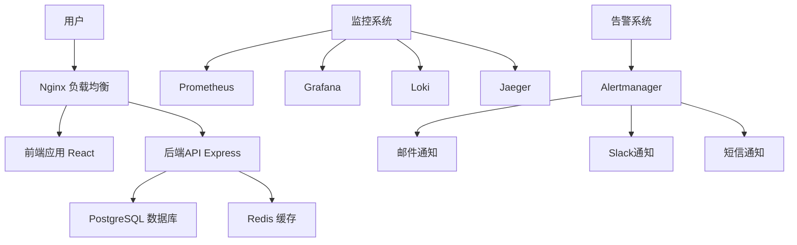
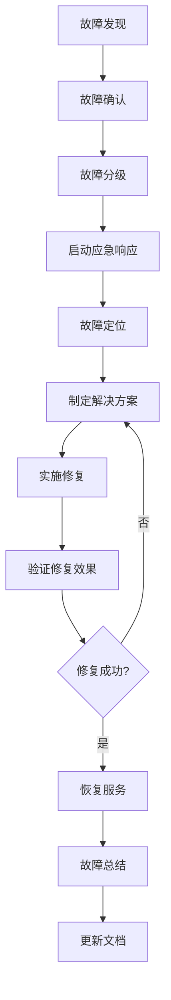

# 博客系统运维手册

## 目录

1. [概述](#概述)
2. [日常运维操作](#日常运维操作)
3. [故障处理流程](#故障处理流程)
4. [监控告警配置](#监控告警配置)
5. [备份恢复策略](#备份恢复策略)
6. [安全管理](#安全管理)
7. [性能调优](#性能调优)
8. [应急响应](#应急响应)
9. [变更管理](#变更管理)
10. [文档维护](#文档维护)

## 概述

本运维手册为博客系统的日常运维提供详细指导，涵盖系统监控、故障处理、安全管理、性能优化等各个方面。运维团队应严格按照本手册执行相关操作，确保系统稳定运行。

### 系统架构概览



### 运维团队职责

- **系统管理员**: 负责系统部署、配置管理、安全策略
- **监控工程师**: 负责监控系统维护、告警规则配置
- **数据库管理员**: 负责数据库性能优化、备份恢复
- **安全工程师**: 负责安全策略制定、漏洞修复
- **值班工程师**: 负责7x24小时系统监控、应急响应

## 日常运维操作

### 系统健康检查

#### 每日检查清单

```bash
#!/bin/bash
# 每日健康检查脚本

echo "=== 博客系统每日健康检查 ==="
echo "检查时间: $(date)"

# 1. 检查服务状态
echo "\n1. 检查服务状态:"
docker ps --format "table {{.Names}}\t{{.Status}}\t{{.Ports}}"

# 2. 检查系统资源
echo "\n2. 系统资源使用情况:"
echo "CPU使用率:"
top -bn1 | grep "Cpu(s)" | awk '{print $2}' | cut -d'%' -f1

echo "内存使用情况:"
free -h

echo "磁盘使用情况:"
df -h

# 3. 检查网络连接
echo "\n3. 网络连接检查:"
netstat -tuln | grep -E ':(80|443|3000|5000|5432|6379)'

# 4. 检查日志错误
echo "\n4. 检查最近1小时的错误日志:"
docker logs --since=1h blog-backend 2>&1 | grep -i error | tail -10
docker logs --since=1h blog-frontend 2>&1 | grep -i error | tail -10

# 5. 检查数据库连接
echo "\n5. 数据库连接检查:"
docker exec blog-postgres pg_isready -U postgres

# 6. 检查Redis连接
echo "\n6. Redis连接检查:"
docker exec blog-redis redis-cli ping

# 7. 检查API健康状态
echo "\n7. API健康检查:"
curl -s http://localhost:5000/health | jq .

echo "\n=== 健康检查完成 ==="
```

#### 每周检查清单

```bash
#!/bin/bash
# 每周维护检查脚本

echo "=== 博客系统每周维护检查 ==="

# 1. 检查磁盘空间趋势
echo "1. 磁盘空间使用趋势:"
du -sh /var/lib/docker/volumes/*

# 2. 检查日志文件大小
echo "\n2. 日志文件大小:"
find /var/log -name "*.log" -type f -exec ls -lh {} \; | sort -k5 -hr | head -10

# 3. 检查Docker镜像
echo "\n3. Docker镜像清理建议:"
docker images --filter "dangling=true" -q

# 4. 检查数据库性能
echo "\n4. 数据库性能检查:"
docker exec blog-postgres psql -U postgres -d blog_prod -c "
    SELECT 
        schemaname,
        tablename,
        attname,
        n_distinct,
        correlation
    FROM pg_stats 
    WHERE schemaname = 'public' 
    ORDER BY n_distinct DESC 
    LIMIT 10;"

# 5. 检查SSL证书有效期
echo "\n5. SSL证书检查:"
echo | openssl s_client -servername yourdomain.com -connect yourdomain.com:443 2>/dev/null | openssl x509 -noout -dates

echo "\n=== 每周检查完成 ==="
```

### 服务管理操作

#### 服务启动/停止

```bash
# 启动所有服务
docker-compose -f docker-compose.prod.yml up -d

# 停止所有服务
docker-compose -f docker-compose.prod.yml down

# 重启特定服务
docker-compose -f docker-compose.prod.yml restart backend

# 查看服务状态
docker-compose -f docker-compose.prod.yml ps

# 查看服务日志
docker-compose -f docker-compose.prod.yml logs -f backend
```

#### 服务扩容/缩容

```bash
# 扩容后端服务到3个实例
docker-compose -f docker-compose.prod.yml up -d --scale backend=3

# 扩容前端服务到2个实例
docker-compose -f docker-compose.prod.yml up -d --scale frontend=2

# 查看扩容后的状态
docker-compose -f docker-compose.prod.yml ps
```

### 日志管理

#### 日志轮转配置

```bash
# /etc/logrotate.d/blog-system
/var/log/blog/*.log {
    daily
    missingok
    rotate 30
    compress
    delaycompress
    notifempty
    create 644 root root
    postrotate
        docker kill -s USR1 $(docker ps -q --filter name=blog-)
    endscript
}
```

#### 日志查询命令

```bash
# 查看实时日志
docker logs -f blog-backend

# 查看最近100行日志
docker logs --tail 100 blog-backend

# 查看特定时间段的日志
docker logs --since="2024-01-15T10:00:00" --until="2024-01-15T11:00:00" blog-backend

# 在Loki中查询日志
curl -G -s "http://localhost:3100/loki/api/v1/query_range" \
  --data-urlencode 'query={service="blog-backend"}' \
  --data-urlencode 'start=2024-01-15T10:00:00Z' \
  --data-urlencode 'end=2024-01-15T11:00:00Z'
```

### 数据库维护

#### 数据库性能监控

```sql
-- 查看活跃连接
SELECT 
    pid,
    usename,
    application_name,
    client_addr,
    state,
    query_start,
    query
FROM pg_stat_activity 
WHERE state = 'active';

-- 查看慢查询
SELECT 
    query,
    calls,
    total_time,
    mean_time,
    rows
FROM pg_stat_statements 
ORDER BY mean_time DESC 
LIMIT 10;

-- 查看表大小
SELECT 
    schemaname,
    tablename,
    pg_size_pretty(pg_total_relation_size(schemaname||'.'||tablename)) as size
FROM pg_tables 
WHERE schemaname = 'public'
ORDER BY pg_total_relation_size(schemaname||'.'||tablename) DESC;
```

#### 数据库优化操作

```sql
-- 重建索引
REINDEX INDEX CONCURRENTLY idx_posts_user_created;

-- 更新统计信息
ANALYZE posts;

-- 清理死元组
VACUUM ANALYZE posts;

-- 查看索引使用情况
SELECT 
    schemaname,
    tablename,
    indexname,
    idx_scan,
    idx_tup_read,
    idx_tup_fetch
FROM pg_stat_user_indexes 
ORDER BY idx_scan DESC;
```

## 故障处理流程

### 故障分级

#### P0 - 紧急故障
- **定义**: 系统完全不可用，影响所有用户
- **响应时间**: 15分钟内
- **解决时间**: 2小时内
- **通知方式**: 电话 + 短信 + 邮件

#### P1 - 高优先级故障
- **定义**: 核心功能不可用，影响大部分用户
- **响应时间**: 30分钟内
- **解决时间**: 4小时内
- **通知方式**: 短信 + 邮件

#### P2 - 中优先级故障
- **定义**: 部分功能异常，影响少数用户
- **响应时间**: 2小时内
- **解决时间**: 24小时内
- **通知方式**: 邮件

#### P3 - 低优先级故障
- **定义**: 轻微问题，不影响核心功能
- **响应时间**: 4小时内
- **解决时间**: 72小时内
- **通知方式**: 工单系统

### 故障处理标准流程



### 常见故障处理手册

#### 1. 服务无响应

**症状**: 用户无法访问网站，API请求超时

**排查步骤**:

```bash
# 1. 检查服务状态
docker ps | grep blog

# 2. 检查端口监听
netstat -tuln | grep -E ':(80|443|3000|5000)'

# 3. 检查负载均衡器
curl -I http://localhost:80

# 4. 检查应用日志
docker logs --tail 50 blog-backend
docker logs --tail 50 blog-frontend

# 5. 检查系统资源
top
free -h
df -h
```

**解决方案**:

```bash
# 如果是容器停止
docker-compose -f docker-compose.prod.yml up -d

# 如果是资源不足
# 清理系统资源
docker system prune -f

# 如果是配置问题
# 检查配置文件并重启
docker-compose -f docker-compose.prod.yml restart
```

#### 2. 数据库连接失败

**症状**: 应用报数据库连接错误

**排查步骤**:

```bash
# 1. 检查数据库容器状态
docker ps | grep postgres

# 2. 检查数据库连接
docker exec blog-postgres pg_isready -U postgres

# 3. 检查连接数
docker exec blog-postgres psql -U postgres -c "SELECT count(*) FROM pg_stat_activity;"

# 4. 检查数据库日志
docker logs blog-postgres | tail -50
```

**解决方案**:

```bash
# 重启数据库容器
docker-compose -f docker-compose.prod.yml restart postgres

# 如果是连接数过多，终止空闲连接
docker exec blog-postgres psql -U postgres -c "
    SELECT pg_terminate_backend(pid) 
    FROM pg_stat_activity 
    WHERE state = 'idle' AND state_change < now() - interval '1 hour';"
```

#### 3. 内存不足

**症状**: 系统响应缓慢，容器被OOM Killer终止

**排查步骤**:

```bash
# 1. 检查内存使用
free -h
docker stats --no-stream

# 2. 检查系统日志
dmesg | grep -i "killed process"

# 3. 检查容器资源限制
docker inspect blog-backend | grep -A 10 "Memory"
```

**解决方案**:

```bash
# 1. 临时释放内存
echo 3 > /proc/sys/vm/drop_caches

# 2. 重启内存使用过高的容器
docker-compose -f docker-compose.prod.yml restart backend

# 3. 调整容器内存限制
# 在docker-compose.yml中增加内存限制
```

#### 4. 磁盘空间不足

**症状**: 应用无法写入日志，数据库写入失败

**排查步骤**:

```bash
# 1. 检查磁盘使用
df -h

# 2. 查找大文件
du -sh /var/lib/docker/volumes/* | sort -hr | head -10
find /var/log -type f -size +100M

# 3. 检查Docker空间使用
docker system df
```

**解决方案**:

```bash
# 1. 清理Docker资源
docker system prune -a -f

# 2. 清理日志文件
find /var/log -name "*.log" -mtime +7 -delete

# 3. 轮转日志
logrotate -f /etc/logrotate.conf

# 4. 清理临时文件
find /tmp -type f -mtime +3 -delete
```

### 故障记录模板

```markdown
# 故障报告 - [故障ID]

## 基本信息
- **故障时间**: 2024-01-15 14:30:00
- **发现时间**: 2024-01-15 14:32:00
- **恢复时间**: 2024-01-15 15:15:00
- **故障等级**: P1
- **影响范围**: 全站用户无法访问
- **负责人**: 张三

## 故障描述
用户反馈网站无法访问，监控系统显示所有API请求返回502错误。

## 故障原因
后端服务因内存不足被OOM Killer终止，导致服务不可用。

## 解决过程
1. 14:32 - 确认故障，检查服务状态
2. 14:35 - 发现后端容器已停止
3. 14:40 - 分析系统日志，确认OOM问题
4. 14:45 - 重启后端服务
5. 15:00 - 调整内存限制配置
6. 15:15 - 服务完全恢复

## 预防措施
1. 增加内存监控告警
2. 优化应用内存使用
3. 设置合理的内存限制
4. 定期进行压力测试

## 经验教训
需要建立更完善的资源监控体系，及时发现资源瓶颈。
```

## 监控告警配置

### Prometheus 告警规则

```yaml
# /etc/prometheus/alert_rules.yml
groups:
  - name: blog-system-alerts
    rules:
      # 服务可用性告警
      - alert: ServiceDown
        expr: up == 0
        for: 1m
        labels:
          severity: critical
        annotations:
          summary: "Service {{ $labels.instance }} is down"
          description: "{{ $labels.instance }} has been down for more than 1 minute."

      # 高错误率告警
      - alert: HighErrorRate
        expr: rate(http_requests_total{status=~"5.."}[5m]) > 0.1
        for: 2m
        labels:
          severity: warning
        annotations:
          summary: "High error rate detected"
          description: "Error rate is {{ $value }} errors per second."

      # 响应时间告警
      - alert: HighResponseTime
        expr: histogram_quantile(0.95, rate(http_request_duration_seconds_bucket[5m])) > 1
        for: 5m
        labels:
          severity: warning
        annotations:
          summary: "High response time detected"
          description: "95th percentile response time is {{ $value }} seconds."

      # CPU使用率告警
      - alert: HighCPUUsage
        expr: 100 - (avg by(instance) (irate(node_cpu_seconds_total{mode="idle"}[5m])) * 100) > 80
        for: 10m
        labels:
          severity: warning
        annotations:
          summary: "High CPU usage detected"
          description: "CPU usage is {{ $value }}% on {{ $labels.instance }}."

      # 内存使用率告警
      - alert: HighMemoryUsage
        expr: (1 - (node_memory_MemAvailable_bytes / node_memory_MemTotal_bytes)) * 100 > 90
        for: 5m
        labels:
          severity: critical
        annotations:
          summary: "High memory usage detected"
          description: "Memory usage is {{ $value }}% on {{ $labels.instance }}."

      # 磁盘空间告警
      - alert: DiskSpaceLow
        expr: (1 - (node_filesystem_avail_bytes / node_filesystem_size_bytes)) * 100 > 85
        for: 5m
        labels:
          severity: warning
        annotations:
          summary: "Disk space is running low"
          description: "Disk usage is {{ $value }}% on {{ $labels.instance }}."

      # 数据库连接告警
      - alert: DatabaseConnectionHigh
        expr: pg_stat_database_numbackends > 80
        for: 5m
        labels:
          severity: warning
        annotations:
          summary: "High database connections"
          description: "Database has {{ $value }} active connections."

      # Redis内存使用告警
      - alert: RedisMemoryHigh
        expr: redis_memory_used_bytes / redis_memory_max_bytes * 100 > 90
        for: 5m
        labels:
          severity: warning
        annotations:
          summary: "Redis memory usage is high"
          description: "Redis memory usage is {{ $value }}%."
```

### Alertmanager 配置

```yaml
# /etc/alertmanager/alertmanager.yml
global:
  smtp_smarthost: 'smtp.gmail.com:587'
  smtp_from: 'alerts@yourdomain.com'
  smtp_auth_username: 'alerts@yourdomain.com'
  smtp_auth_password: 'your-app-password'

route:
  group_by: ['alertname', 'cluster', 'service']
  group_wait: 10s
  group_interval: 10s
  repeat_interval: 1h
  receiver: 'default'
  routes:
    - match:
        severity: critical
      receiver: 'critical-alerts'
    - match:
        severity: warning
      receiver: 'warning-alerts'

receivers:
  - name: 'default'
    email_configs:
      - to: 'ops-team@yourdomain.com'
        subject: '[ALERT] {{ .GroupLabels.alertname }}'
        body: |
          {{ range .Alerts }}
          Alert: {{ .Annotations.summary }}
          Description: {{ .Annotations.description }}
          Labels: {{ range .Labels.SortedPairs }}{{ .Name }}={{ .Value }} {{ end }}
          {{ end }}

  - name: 'critical-alerts'
    email_configs:
      - to: 'ops-team@yourdomain.com,management@yourdomain.com'
        subject: '[CRITICAL] {{ .GroupLabels.alertname }}'
        body: |
          CRITICAL ALERT!
          
          {{ range .Alerts }}
          Alert: {{ .Annotations.summary }}
          Description: {{ .Annotations.description }}
          Time: {{ .StartsAt }}
          Labels: {{ range .Labels.SortedPairs }}{{ .Name }}={{ .Value }} {{ end }}
          {{ end }}
    slack_configs:
      - api_url: 'https://hooks.slack.com/services/YOUR/SLACK/WEBHOOK'
        channel: '#alerts'
        title: 'CRITICAL ALERT'
        text: '{{ range .Alerts }}{{ .Annotations.summary }}{{ end }}'

  - name: 'warning-alerts'
    email_configs:
      - to: 'ops-team@yourdomain.com'
        subject: '[WARNING] {{ .GroupLabels.alertname }}'
        body: |
          {{ range .Alerts }}
          Alert: {{ .Annotations.summary }}
          Description: {{ .Annotations.description }}
          {{ end }}
```

### Grafana 仪表板配置

#### 系统概览仪表板

```json
{
  "dashboard": {
    "title": "博客系统概览",
    "panels": [
      {
        "title": "服务状态",
        "type": "stat",
        "targets": [
          {
            "expr": "up",
            "legendFormat": "{{ instance }}"
          }
        ]
      },
      {
        "title": "请求量",
        "type": "graph",
        "targets": [
          {
            "expr": "rate(http_requests_total[5m])",
            "legendFormat": "{{ method }} {{ status }}"
          }
        ]
      },
      {
        "title": "响应时间",
        "type": "graph",
        "targets": [
          {
            "expr": "histogram_quantile(0.95, rate(http_request_duration_seconds_bucket[5m]))",
            "legendFormat": "95th percentile"
          },
          {
            "expr": "histogram_quantile(0.50, rate(http_request_duration_seconds_bucket[5m]))",
            "legendFormat": "50th percentile"
          }
        ]
      },
      {
        "title": "错误率",
        "type": "graph",
        "targets": [
          {
            "expr": "rate(http_requests_total{status=~\"5..\"}[5m]) / rate(http_requests_total[5m])",
            "legendFormat": "Error Rate"
          }
        ]
      }
    ]
  }
}
```

### 监控数据保留策略

```yaml
# Prometheus 数据保留配置
global:
  scrape_interval: 15s
  evaluation_interval: 15s
  external_labels:
    cluster: 'blog-system'
    environment: 'production'

# 数据保留期设置
storage:
  tsdb:
    retention.time: 30d
    retention.size: 10GB
    wal-compression: true
```

## 备份恢复策略

### 备份策略概述

#### 备份类型

1. **全量备份**: 每周日凌晨2点执行
2. **增量备份**: 每日凌晨3点执行
3. **实时备份**: 关键操作实时备份
4. **配置备份**: 配置文件变更时备份

#### 备份保留策略

- **日备份**: 保留30天
- **周备份**: 保留12周
- **月备份**: 保留12个月
- **年备份**: 保留5年

### 数据库备份

#### 自动备份脚本

```bash
#!/bin/bash
# /opt/scripts/backup-database.sh

set -e

# 配置变量
BACKUP_DIR="/opt/backups/database"
DATE=$(date +%Y%m%d_%H%M%S)
RETENTION_DAYS=30
DB_CONTAINER="blog-postgres"
DB_NAME="blog_prod"
DB_USER="postgres"

# 创建备份目录
mkdir -p $BACKUP_DIR

echo "开始数据库备份: $DATE"

# 执行备份
docker exec $DB_CONTAINER pg_dump -U $DB_USER -d $DB_NAME | gzip > $BACKUP_DIR/blog_db_$DATE.sql.gz

# 检查备份文件
if [ -f "$BACKUP_DIR/blog_db_$DATE.sql.gz" ]; then
    echo "备份成功: blog_db_$DATE.sql.gz"
    
    # 记录备份信息
    echo "$DATE,$(stat -c%s $BACKUP_DIR/blog_db_$DATE.sql.gz),success" >> $BACKUP_DIR/backup.log
    
    # 清理旧备份
    find $BACKUP_DIR -name "blog_db_*.sql.gz" -mtime +$RETENTION_DAYS -delete
    
    echo "备份完成"
else
    echo "备份失败"
    echo "$DATE,0,failed" >> $BACKUP_DIR/backup.log
    exit 1
fi
```

#### 数据库恢复脚本

```bash
#!/bin/bash
# /opt/scripts/restore-database.sh

set -e

if [ $# -ne 1 ]; then
    echo "使用方法: $0 <backup_file>"
    echo "示例: $0 /opt/backups/database/blog_db_20240115_030000.sql.gz"
    exit 1
fi

BACKUP_FILE=$1
DB_CONTAINER="blog-postgres"
DB_NAME="blog_prod"
DB_USER="postgres"

# 检查备份文件
if [ ! -f "$BACKUP_FILE" ]; then
    echo "错误: 备份文件不存在: $BACKUP_FILE"
    exit 1
fi

echo "警告: 此操作将覆盖当前数据库数据!"
read -p "确认继续? (yes/no): " confirm

if [ "$confirm" != "yes" ]; then
    echo "操作已取消"
    exit 0
fi

echo "开始恢复数据库..."

# 停止应用服务
echo "停止应用服务..."
docker-compose -f docker-compose.prod.yml stop backend frontend

# 创建恢复前备份
echo "创建恢复前备份..."
RESTORE_BACKUP_DIR="/opt/backups/pre-restore"
mkdir -p $RESTORE_BACKUP_DIR
DATE=$(date +%Y%m%d_%H%M%S)
docker exec $DB_CONTAINER pg_dump -U $DB_USER -d $DB_NAME | gzip > $RESTORE_BACKUP_DIR/pre_restore_$DATE.sql.gz

# 删除现有数据库
echo "删除现有数据库..."
docker exec $DB_CONTAINER psql -U $DB_USER -c "DROP DATABASE IF EXISTS $DB_NAME;"
docker exec $DB_CONTAINER psql -U $DB_USER -c "CREATE DATABASE $DB_NAME;"

# 恢复数据
echo "恢复数据..."
zcat $BACKUP_FILE | docker exec -i $DB_CONTAINER psql -U $DB_USER -d $DB_NAME

# 重启应用服务
echo "重启应用服务..."
docker-compose -f docker-compose.prod.yml start backend frontend

# 验证恢复
echo "验证数据库连接..."
sleep 10
curl -f http://localhost:5000/health

if [ $? -eq 0 ]; then
    echo "数据库恢复成功!"
else
    echo "警告: 应用服务可能未正常启动，请检查日志"
fi
```

### 文件系统备份

#### 应用文件备份

```bash
#!/bin/bash
# /opt/scripts/backup-files.sh

set -e

BACKUP_DIR="/opt/backups/files"
DATE=$(date +%Y%m%d_%H%M%S)
SOURCE_DIRS=(
    "/opt/blog-system"
    "/etc/nginx"
    "/etc/ssl"
    "/var/log/blog"
)

mkdir -p $BACKUP_DIR

echo "开始文件备份: $DATE"

# 创建备份归档
tar -czf $BACKUP_DIR/files_$DATE.tar.gz \
    --exclude='node_modules' \
    --exclude='*.log' \
    --exclude='.git' \
    "${SOURCE_DIRS[@]}"

echo "文件备份完成: files_$DATE.tar.gz"

# 清理旧备份
find $BACKUP_DIR -name "files_*.tar.gz" -mtime +7 -delete
```

#### Docker卷备份

```bash
#!/bin/bash
# /opt/scripts/backup-volumes.sh

set -e

BACKUP_DIR="/opt/backups/volumes"
DATE=$(date +%Y%m%d_%H%M%S)

mkdir -p $BACKUP_DIR

echo "开始Docker卷备份: $DATE"

# 备份所有博客系统相关的卷
for volume in $(docker volume ls -q | grep blog); do
    echo "备份卷: $volume"
    docker run --rm \
        -v $volume:/data \
        -v $BACKUP_DIR:/backup \
        alpine tar -czf /backup/${volume}_$DATE.tar.gz -C /data .
done

echo "Docker卷备份完成"

# 清理旧备份
find $BACKUP_DIR -name "*_*.tar.gz" -mtime +14 -delete
```

### 备份验证

#### 备份完整性检查

```bash
#!/bin/bash
# /opt/scripts/verify-backup.sh

set -e

BACKUP_DIR="/opt/backups"
LOG_FILE="/var/log/backup-verification.log"

echo "$(date): 开始备份验证" >> $LOG_FILE

# 检查数据库备份
echo "检查数据库备份..."
for backup in $(find $BACKUP_DIR/database -name "*.sql.gz" -mtime -1); do
    echo "验证: $backup"
    
    # 检查文件完整性
    if gzip -t "$backup"; then
        echo "$(date): $backup - 文件完整性检查通过" >> $LOG_FILE
    else
        echo "$(date): $backup - 文件完整性检查失败" >> $LOG_FILE
        continue
    fi
    
    # 检查SQL语法
    if zcat "$backup" | head -100 | grep -q "PostgreSQL database dump"; then
        echo "$(date): $backup - SQL格式检查通过" >> $LOG_FILE
    else
        echo "$(date): $backup - SQL格式检查失败" >> $LOG_FILE
    fi
done

# 检查文件备份
echo "检查文件备份..."
for backup in $(find $BACKUP_DIR/files -name "*.tar.gz" -mtime -1); do
    echo "验证: $backup"
    
    if tar -tzf "$backup" > /dev/null 2>&1; then
        echo "$(date): $backup - 归档完整性检查通过" >> $LOG_FILE
    else
        echo "$(date): $backup - 归档完整性检查失败" >> $LOG_FILE
    fi
done

echo "$(date): 备份验证完成" >> $LOG_FILE
```

### 灾难恢复计划

#### 完整系统恢复流程

```bash
#!/bin/bash
# /opt/scripts/disaster-recovery.sh

set -e

echo "=== 博客系统灾难恢复流程 ==="
echo "警告: 此操作将完全重建系统!"
read -p "确认继续? (yes/no): " confirm

if [ "$confirm" != "yes" ]; then
    echo "操作已取消"
    exit 0
fi

# 1. 系统环境准备
echo "1. 准备系统环境..."
sudo apt update
sudo apt install -y docker.io docker-compose git

# 2. 恢复应用代码
echo "2. 恢复应用代码..."
cd /opt
git clone https://github.com/your-org/blog-system.git
cd blog-system

# 3. 恢复配置文件
echo "3. 恢复配置文件..."
cp /opt/backups/config/.env.production .
cp /opt/backups/config/docker-compose.prod.yml .

# 4. 启动基础服务
echo "4. 启动基础服务..."
docker-compose -f docker-compose.prod.yml up -d postgres redis

# 5. 恢复数据库
echo "5. 恢复数据库..."
LATEST_DB_BACKUP=$(ls -t /opt/backups/database/blog_db_*.sql.gz | head -1)
echo "使用备份: $LATEST_DB_BACKUP"
./scripts/restore-database.sh "$LATEST_DB_BACKUP"

# 6. 启动应用服务
echo "6. 启动应用服务..."
docker-compose -f docker-compose.prod.yml up -d

# 7. 验证系统
echo "7. 验证系统..."
sleep 30
curl -f http://localhost:5000/health
curl -f http://localhost:3000

echo "=== 灾难恢复完成 ==="
echo "请检查系统功能是否正常"
```

## 安全管理

### 安全策略概述

#### 安全原则

1. **最小权限原则**: 用户和服务只获得必要的最小权限
2. **深度防御**: 多层安全防护机制
3. **零信任架构**: 不信任任何网络流量，验证所有访问
4. **持续监控**: 实时监控安全事件和异常行为
5. **定期审计**: 定期进行安全审计和漏洞扫描

### 访问控制管理

#### 用户权限管理

```bash
#!/bin/bash
# /opt/scripts/user-management.sh

# 创建运维用户组
sudo groupadd -f ops-team
sudo groupadd -f dev-team
sudo groupadd -f readonly-team

# 创建服务账户
sudo useradd -r -s /bin/false blog-app
sudo useradd -r -s /bin/false blog-monitor

# 设置目录权限
sudo chown -R blog-app:blog-app /opt/blog-system
sudo chmod -R 750 /opt/blog-system

# 设置日志目录权限
sudo chown -R blog-app:ops-team /var/log/blog
sudo chmod -R 640 /var/log/blog

# 设置配置文件权限
sudo chmod 600 /opt/blog-system/.env.production
sudo chown blog-app:blog-app /opt/blog-system/.env.production
```

#### SSH访问控制

```bash
# /etc/ssh/sshd_config 安全配置

# 禁用root登录
PermitRootLogin no

# 使用密钥认证
PasswordAuthentication no
PubkeyAuthentication yes

# 限制登录用户
AllowGroups ops-team

# 设置连接限制
MaxAuthTries 3
MaxSessions 5
ClientAliveInterval 300
ClientAliveCountMax 2

# 禁用不安全的功能
PermitEmptyPasswords no
X11Forwarding no
AllowTcpForwarding no
```

### 网络安全配置

#### 防火墙规则

```bash
#!/bin/bash
# /opt/scripts/setup-firewall.sh

# 重置防火墙规则
sudo ufw --force reset

# 默认策略
sudo ufw default deny incoming
sudo ufw default allow outgoing

# 允许SSH (限制IP)
sudo ufw allow from 192.168.1.0/24 to any port 22

# 允许HTTP/HTTPS
sudo ufw allow 80/tcp
sudo ufw allow 443/tcp

# 允许监控端口 (限制内网)
sudo ufw allow from 192.168.1.0/24 to any port 3000  # Grafana
sudo ufw allow from 192.168.1.0/24 to any port 9090  # Prometheus

# 拒绝数据库直接访问
sudo ufw deny 5432/tcp
sudo ufw deny 6379/tcp

# 启用防火墙
sudo ufw --force enable

# 显示规则
sudo ufw status verbose
```

#### Nginx安全配置

```nginx
# /etc/nginx/conf.d/security.conf

# 隐藏Nginx版本
server_tokens off;

# 安全头设置
add_header X-Frame-Options "SAMEORIGIN" always;
add_header X-Content-Type-Options "nosniff" always;
add_header X-XSS-Protection "1; mode=block" always;
add_header Referrer-Policy "strict-origin-when-cross-origin" always;
add_header Content-Security-Policy "default-src 'self'; script-src 'self' 'unsafe-inline'; style-src 'self' 'unsafe-inline'; img-src 'self' data: https:; font-src 'self'; connect-src 'self'; frame-ancestors 'none';" always;
add_header Strict-Transport-Security "max-age=31536000; includeSubDomains" always;

# 限制请求大小
client_max_body_size 10M;
client_body_buffer_size 128k;

# 限制请求速率
limit_req_zone $binary_remote_addr zone=api:10m rate=10r/s;
limit_req_zone $binary_remote_addr zone=login:10m rate=1r/s;

# 禁止访问敏感文件
location ~ /\. {
    deny all;
    access_log off;
    log_not_found off;
}

location ~ \.(env|config|ini|log|sh|sql|conf)$ {
    deny all;
    access_log off;
    log_not_found off;
}

# API速率限制
location /api/ {
    limit_req zone=api burst=20 nodelay;
    proxy_pass http://backend;
}

# 登录接口特殊限制
location /api/auth/login {
    limit_req zone=login burst=5 nodelay;
    proxy_pass http://backend;
}
```

### SSL/TLS配置

#### SSL证书管理

```bash
#!/bin/bash
# /opt/scripts/ssl-management.sh

# 安装Certbot
sudo apt install -y certbot python3-certbot-nginx

# 获取SSL证书
sudo certbot --nginx -d yourdomain.com -d www.yourdomain.com

# 设置自动续期
echo "0 12 * * * /usr/bin/certbot renew --quiet" | sudo crontab -

# 检查证书状态
certbot certificates

# 测试续期
sudo certbot renew --dry-run
```

#### SSL配置优化

```nginx
# /etc/nginx/ssl.conf

# SSL协议版本
ssl_protocols TLSv1.2 TLSv1.3;

# 加密套件
ssl_ciphers ECDHE-RSA-AES256-GCM-SHA512:DHE-RSA-AES256-GCM-SHA512:ECDHE-RSA-AES256-GCM-SHA384:DHE-RSA-AES256-GCM-SHA384;
ssl_prefer_server_ciphers off;

# SSL会话缓存
ssl_session_cache shared:SSL:10m;
ssl_session_timeout 10m;

# OCSP装订
ssl_stapling on;
ssl_stapling_verify on;
resolver 8.8.8.8 8.8.4.4 valid=300s;
resolver_timeout 5s;

# DH参数
ssl_dhparam /etc/ssl/certs/dhparam.pem;
```

### 安全监控

#### 入侵检测系统

```bash
#!/bin/bash
# /opt/scripts/setup-ids.sh

# 安装Fail2ban
sudo apt install -y fail2ban

# 配置Fail2ban
sudo tee /etc/fail2ban/jail.local << EOF
[DEFAULT]
bantime = 3600
findtime = 600
maxretry = 3
ignoreip = 127.0.0.1/8 192.168.1.0/24

[sshd]
enabled = true
port = ssh
logpath = /var/log/auth.log
maxretry = 3

[nginx-http-auth]
enabled = true
filter = nginx-http-auth
logpath = /var/log/nginx/error.log
maxretry = 3

[nginx-limit-req]
enabled = true
filter = nginx-limit-req
logpath = /var/log/nginx/error.log
maxretry = 3
EOF

# 启动Fail2ban
sudo systemctl enable fail2ban
sudo systemctl start fail2ban

# 检查状态
sudo fail2ban-client status
```

#### 日志监控

```bash
#!/bin/bash
# /opt/scripts/security-monitoring.sh

# 监控可疑登录
echo "=== 可疑登录检查 ==="
grep "Failed password" /var/log/auth.log | tail -10

# 监控权限提升
echo "\n=== 权限提升检查 ==="
grep "sudo" /var/log/auth.log | tail -10

# 监控文件系统变化
echo "\n=== 关键文件变化检查 ==="
find /etc -name "*.conf" -mtime -1 -ls
find /opt/blog-system -name "*.env*" -mtime -1 -ls

# 监控网络连接
echo "\n=== 异常网络连接检查 ==="
netstat -tuln | grep -E ':(22|80|443|3000|5000)' | grep -v '127.0.0.1'

# 监控进程
echo "\n=== 异常进程检查 ==="
ps aux | grep -E '(nc|netcat|nmap|wget|curl)' | grep -v grep

# 检查Docker容器
echo "\n=== Docker容器安全检查 ==="
docker ps --format "table {{.Names}}\t{{.Image}}\t{{.Status}}"
```

### 漏洞管理

#### 系统漏洞扫描

```bash
#!/bin/bash
# /opt/scripts/vulnerability-scan.sh

# 更新系统
echo "更新系统包..."
sudo apt update
sudo apt list --upgradable

# 检查Docker镜像漏洞
echo "\n检查Docker镜像漏洞..."
for image in $(docker images --format "{{.Repository}}:{{.Tag}}" | grep blog); do
    echo "扫描镜像: $image"
    docker run --rm -v /var/run/docker.sock:/var/run/docker.sock \
        aquasec/trivy image $image
done

# 检查依赖漏洞
echo "\n检查Node.js依赖漏洞..."
cd /opt/blog-system
npm audit

# 检查系统配置
echo "\n检查系统安全配置..."
lynis audit system --quick
```

#### 安全更新流程

```bash
#!/bin/bash
# /opt/scripts/security-update.sh

set -e

echo "=== 安全更新流程 ==="

# 1. 创建系统快照
echo "1. 创建系统快照..."
./backup-system.sh

# 2. 更新系统包
echo "2. 更新系统包..."
sudo apt update
sudo apt upgrade -y

# 3. 更新Docker镜像
echo "3. 更新Docker镜像..."
docker-compose -f docker-compose.prod.yml pull

# 4. 重启服务
echo "4. 重启服务..."
docker-compose -f docker-compose.prod.yml up -d

# 5. 验证系统
echo "5. 验证系统..."
sleep 30
curl -f http://localhost:5000/health

# 6. 更新依赖
echo "6. 更新应用依赖..."
npm audit fix

echo "安全更新完成"
```

## 性能调优

### 系统性能监控

#### 性能基准测试

```bash
#!/bin/bash
# /opt/scripts/performance-benchmark.sh

echo "=== 博客系统性能基准测试 ==="

# 1. 系统资源基准
echo "1. 系统资源基准:"
echo "CPU信息:"
lscpu | grep -E '(Model name|CPU\(s\)|Thread|Core)'

echo "\n内存信息:"
free -h

echo "\n磁盘性能:"
dd if=/dev/zero of=/tmp/testfile bs=1G count=1 oflag=direct 2>&1 | grep copied
rm -f /tmp/testfile

# 2. 网络性能测试
echo "\n2. 网络性能测试:"
ping -c 5 8.8.8.8

# 3. 数据库性能测试
echo "\n3. 数据库性能测试:"
docker exec blog-postgres psql -U postgres -d blog_prod -c "
    EXPLAIN ANALYZE SELECT * FROM posts ORDER BY created_at DESC LIMIT 10;"

# 4. API性能测试
echo "\n4. API性能测试:"
ab -n 1000 -c 10 http://localhost:5000/api/posts

# 5. 前端性能测试
echo "\n5. 前端性能测试:"
lighthouse http://localhost:3000 --output json --output-path /tmp/lighthouse.json
cat /tmp/lighthouse.json | jq '.categories.performance.score'
```

#### 性能监控脚本

```bash
#!/bin/bash
# /opt/scripts/performance-monitor.sh

LOG_FILE="/var/log/performance-monitor.log"
DATE=$(date '+%Y-%m-%d %H:%M:%S')

# 记录系统性能指标
echo "$DATE - 性能监控开始" >> $LOG_FILE

# CPU使用率
CPU_USAGE=$(top -bn1 | grep "Cpu(s)" | awk '{print $2}' | cut -d'%' -f1)
echo "$DATE - CPU使用率: $CPU_USAGE%" >> $LOG_FILE

# 内存使用率
MEM_USAGE=$(free | grep Mem | awk '{printf "%.2f", $3/$2 * 100.0}')
echo "$DATE - 内存使用率: $MEM_USAGE%" >> $LOG_FILE

# 磁盘使用率
DISK_USAGE=$(df -h / | awk 'NR==2 {print $5}' | cut -d'%' -f1)
echo "$DATE - 磁盘使用率: $DISK_USAGE%" >> $LOG_FILE

# 数据库连接数
DB_CONNECTIONS=$(docker exec blog-postgres psql -U postgres -t -c "SELECT count(*) FROM pg_stat_activity;" | xargs)
echo "$DATE - 数据库连接数: $DB_CONNECTIONS" >> $LOG_FILE

# API响应时间
API_RESPONSE_TIME=$(curl -o /dev/null -s -w '%{time_total}' http://localhost:5000/health)
echo "$DATE - API响应时间: ${API_RESPONSE_TIME}s" >> $LOG_FILE

echo "$DATE - 性能监控完成" >> $LOG_FILE
```

### 应用性能优化

#### 数据库优化

```sql
-- 数据库性能优化脚本

-- 1. 创建必要的索引
CREATE INDEX CONCURRENTLY IF NOT EXISTS idx_posts_user_created 
    ON posts(user_id, created_at DESC);

CREATE INDEX CONCURRENTLY IF NOT EXISTS idx_posts_published 
    ON posts(published, created_at DESC) WHERE published = true;

CREATE INDEX CONCURRENTLY IF NOT EXISTS idx_comments_post 
    ON comments(post_id, created_at DESC);

-- 2. 优化查询
-- 使用部分索引
CREATE INDEX CONCURRENTLY IF NOT EXISTS idx_posts_featured 
    ON posts(created_at DESC) WHERE featured = true;

-- 3. 分析表统计信息
ANALYZE posts;
ANALYZE comments;
ANALYZE users;

-- 4. 检查索引使用情况
SELECT 
    schemaname,
    tablename,
    indexname,
    idx_scan,
    idx_tup_read,
    idx_tup_fetch
FROM pg_stat_user_indexes 
WHERE idx_scan = 0;

-- 5. 查看慢查询
SELECT 
    query,
    calls,
    total_time,
    mean_time,
    rows
FROM pg_stat_statements 
WHERE mean_time > 100
ORDER BY mean_time DESC 
LIMIT 10;
```

#### 缓存优化

```javascript
// Redis缓存优化配置

// 1. 连接池配置
const redis = new Redis({
  host: process.env.REDIS_HOST,
  port: process.env.REDIS_PORT,
  password: process.env.REDIS_PASSWORD,
  retryDelayOnFailover: 100,
  maxRetriesPerRequest: 3,
  lazyConnect: true,
  keepAlive: 30000,
  family: 4,
  db: 0
});

// 2. 缓存策略
class CacheManager {
  // 文章列表缓存
  async getPostsList(page, limit) {
    const cacheKey = `posts:list:${page}:${limit}`;
    const cached = await redis.get(cacheKey);
    
    if (cached) {
      return JSON.parse(cached);
    }
    
    const posts = await db.query(
      'SELECT * FROM posts WHERE published = true ORDER BY created_at DESC LIMIT $1 OFFSET $2',
      [limit, (page - 1) * limit]
    );
    
    // 缓存5分钟
    await redis.setex(cacheKey, 300, JSON.stringify(posts));
    return posts;
  }
  
  // 文章详情缓存
  async getPost(id) {
    const cacheKey = `post:${id}`;
    const cached = await redis.get(cacheKey);
    
    if (cached) {
      return JSON.parse(cached);
    }
    
    const post = await db.query('SELECT * FROM posts WHERE id = $1', [id]);
    
    if (post) {
      // 缓存1小时
      await redis.setex(cacheKey, 3600, JSON.stringify(post));
    }
    
    return post;
  }
  
  // 清除相关缓存
  async invalidatePostCache(postId) {
    const keys = await redis.keys('posts:list:*');
    if (keys.length > 0) {
      await redis.del(...keys);
    }
    await redis.del(`post